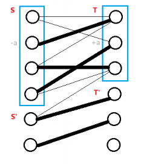

我只是想做一下筆記
然後我還是不會縮花/帶花樹演算法，所以我也不會一般圖最大權匹配

# 先備知識
看得懂$\sum$
然後會(不帶權)二分圖匹配的匈牙利演算法

# Kuhn Munkres
這裡介紹KM演算法，而若要求解二分圖上的最大權匹配等相關問題可以透過下面的演算法轉換成KM的模型。
KM演算法是用來求一張完全二分圖的最大權完美匹配的演算法，其中邊的權重都是非負的。
## 演算法轉換
- 最大權匹配 $\to$ 最大權完全二分圖完美匹配(非負邊權)
  把不存在的邊以及負邊權的邊邊權設成0
- 最大權完美匹配(有負邊權) $\to$ 最大權完全二分圖完美匹配(非負邊權)
  把不存在的邊邊權設成0，並且把剩下每條邊的邊權加上一個夠大的數$M$，這樣就會傾向於選出儘量多邊。最後的答案記得要扣掉這些$M$

可以想想看為什麼上面兩種轉換是對的

把問題敘述再好好的寫一遍
## Description
> 給你一張完全二分圖 $K _ {n,n}$ ，每條邊 $e = (x_i,y_j)$ 有邊權 $w _ e$
> 請選出 $n$ 條邊 $e_1, e_2, \cdots e_n$ 兩兩不共端點，使得邊權和$\sum\limits _ {i=1}^n w _ {e _ i}$最大

## 對偶問題
首先引入頂標的概念。對於每個頂點$v$我們維護一個數字$L_v$，稱為頂標。
在演算法的過程中，我們必須妥當的維護頂標，使得對於所有邊$e=(a,b)$都有$L_a+L_b \geq w_e$
那麼很顯然的，對於任何一種合法的頂標來說，頂標的總和會大於等於最大權完美匹配的值。
因為對於任何匹配$M$都有$\sum\limits _ {e\in M} w_e \leq \sum\limits _ {e\in M, e = (a,b)} (L_a + L_b) \leq \sum\limits _ {v\in V} L_v$

另外，對於一個合法的頂標配置$L$，考慮所有$L_a+L_b = w_e$的邊$e=(a,b)$所形成的子圖$G'$(我們稱這類$e$為等邊)
若這個子圖有完美匹配的話那麼顯然：**原圖最大權完美匹配 $=$ $G'$的最大權完美匹配 $=$ $\sum _ {v\in V} L _ v$**
事實上，我們可以得出更強的結論，即**最大權完美匹配 $=$ 所有合法頂標配置中總和最小者**，不過證明我不會> <

## 演算法的步驟
KM演算法的(非常模糊的)步驟大致如下：
1. 依序以$x_1, x_2, \dots, x_n$為起點尋找增廣路徑，但限制只能走等邊，即$e=(a,b)$滿足$L_a+L_b=w_e$
2. 如果找不到增廣路徑，我們就必須調整頂標，使得之前已經匹配好的邊仍然滿足等號，並且有機會在調整之後多出可以增廣的等邊
3. 關於頂標的初始化以及如何調整頂標：

- 初始化：不失一般性一開始可以初始化$L _ {x_i} = \max\limits _ {x_i \in e} w_e, L _ {y _ i} = 0$
- 如何調整頂標：由於在前一步我們找增廣路徑失敗了，這表示我們找到的是一個交錯樹，樹上的邊都是等邊。我們考慮把所有在樹上的$x_i$或$y_j$，讓$L _ {x_i}$減少$\delta$，$L _ {y_j}$增加$\delta$。
問題在於如何取這個$\delta$。想要讓可以增廣的邊變多的話，肯定是多了連接樹上和非樹上的頂點的非等邊，我們取$\delta$是所有這種非等邊$e=(a,b)$的$L _ a + L _ b - w_e$的最小值，這樣就能確定我們每次調整頂標都會至少多一條等邊(也至少多一個點跑到樹上！)，並且原有的等邊不會變少(如果你不確定可以看下面的圖想一下為什麼)。



注意到所謂樹上的點就是在 `dfs` 有走到的點owo


## 扣得
以下是一個$\mathcal{O}(n^4)$的版本。
首先是宣告和建圖的部份。 `g[a][b]` 代表$e=(a,b)$的權重$w_e$； `lx[i], ly[j]` 分別代表$L _ {x_i}, L _ {y_i}$， `visx, visy` 是用在dfs的時候； `match[j]=i` 代表$y_j$跟$x_i$匹配了，如果沒人跟他匹配則是 `-1` 。
```cpp
const int N = 125, inf = 1e9;
int g[N][N];
int lx[N], ly[N];
int visx[N], visy[N], match[N];
int n;
void init(int _n) {
    n = _n;
    for(int i = 0; i < n; i++) for(int j = 0; j < n; j++) g[i][j] = 0;
}
void addEdge(int a, int b, int weight) {
    g[a][b] = max(g[a][b], weight);
}
```
接下來是我們的主程式
```cpp
int solve() {
    for(int i = 0; i < n; i++) {
        lx[i] = ly[i] = 0;
        for(int j = 0; j < n; j++) lx[i] = max(lx[i], g[i][j]);
    }
    for(int i = 0; i < n; i++) match[i] = -1;
    for(int i = 0; i < n; i++) while(!augment(i)) relabel();
    int ans = 0;
    for(int j = 0; j < n; j++) if(match[j] != -1) ans += g[match[j]][j];
    return ans;
}
```

大家應該很好奇 `augment(i)` 跟 `relabel()` 怎麼寫的吧！事實上 `augment(i)` 就只是初始化 `vis` 陣列並且 `dfs` 只走等邊找增廣路徑；而 `relabel()` 就是用剛剛提到的方法修改頂標。程式碼如下：

```cpp
bool dfs(int i) {
    if(visx[i]) return false;
    visx[i] = true;
    for(int j = 0; j < n; j++) if(!visy[j]) {
        int d = lx[i] + ly[j] - g[i][j];
        if(d == 0) {
            visy[j] = true;
            if(match[j] == -1 || dfs(match[j])) {
                match[j] = i;
                return true;
            }
        }
    }
    return false;
}
bool augment(int x) {
    for(int i = 0; i < n; i++) visx[i] = visy[i] = false;
    return dfs(x);
}
void relabel() {
    int delta = inf;
    for(int i = 0; i < n; i++) if(visx[i]) {
        for(int j = 0; j < n; j++) if(!visy[j]) {
            delta = min(delta, lx[i] + ly[j] - g[i][j]);
        }
    }
    for(int i = 0; i < n; i++) if(visx[i]) lx[i] -= delta;
    for(int j = 0; j < n; j++) if(visy[j]) ly[j] += delta;
}
```

## 時間複雜度
每次dfs並重新標號的時間是 $\mathcal{O}(n^2)$ ，對於每個 $x_i$ ，最多就只要調整 $n$ 次頂標就能成功增廣，找到跟他配的 $y_j$ ，因為每次調整頂標都會至少多出一個 $y_j$ 和 $x_i$ 可以透過等邊連通。所以總時間複雜度是 $\mathcal{O}(n^4)$ 。

## slack優化
這個演算法實際上可以簡單的優化到 $\mathcal{O}(n^3)$ 。瓶頸在於 `while(!augment(i)) relabel();` 這部份。
對於每個沒有在交錯樹內的 $y_j$ ，我們維護一個變數 `slack[j]` ，維護  $\min (L _ {x_i} + L _ {y_i} - w _ {(x_i, y_j)})$ ，其中 $x_i$ 必須在交錯樹上。這樣子每次 `relabel()` 要找 $\delta$ 就只要花 $\mathcal{O}(n)$ 了，但是如果仍然重設 `vis` 陣列每次從 $x_i$  `dfs` 那時間複雜度也沒變，畢竟 `dfs` 是 $\mathcal{O}(V+E)$ 的事情。

首先，注意到做完頂標的調整之後，樹上的點 `slack` 不會有變化；反之不在樹上的 $y_j$ 我們則可以知道他的 `slack` 減少了 $\delta$ 。接著，假如調整完頂標之後找到了增廣路徑，路徑的端點會是**不在交錯樹上的 $y _ j$ 並且 `slack[j]` 是0**的形式，因此我們每次不應該重設 `vis` ，而是應該檢查是否有包含這些點的增廣路徑，或是讓交錯樹擴展。
因為我們不重設 `vis` ，每個點最多被 `dfs` 一次，會跑滿他的 $n$ 個鄰居，所以在一個 $x_i$ 的phase當中 `dfs` 的總複雜度是 $\mathcal{O}(n^2)$

這邊附上一份可以AC TIOJ 1042的code。

```cpp
#include <bits/stdc++.h>

using namespace std;
const int inf = 1e9;

struct KuhnMunkres {
    int n;
    vector<vector<int>> g;
    vector<int> lx, ly, slack;
    vector<int> match, visx, visy;
    KuhnMunkres(int n) : n(n), g(n, vector<int>(n)),
        lx(n), ly(n), slack(n), match(n), visx(n), visy(n) {}
    vector<int> & operator[](int i) { return g[i]; }
    bool dfs(int i, bool aug) { // aug = true 表示要更新 match
        if(visx[i]) return false;
        visx[i] = true;
        for(int j = 0; j < n; j++) {
            if(visy[j]) continue;
            // 一邊擴增交錯樹、尋找增廣路徑
            // 一邊更新slack：樹上的點跟樹外的點所造成的最小權重
            int d = lx[i] + ly[j] - g[i][j];
            if(d == 0) {
                visy[j] = true;
                if(match[j] == -1 || dfs(match[j], aug)) {
                    if(aug)
                        match[j] = i;
                    return true;
                }
            } else {
                slack[j] = min(slack[j], d);
            }
        }
        return false;
    }
    bool augment() { // 回傳是否有增廣路
        for(int j = 0; j < n; j++) if(!visy[j] && slack[j] == 0) {
            visy[j] = true;
            if(match[j] == -1 || dfs(match[j], false)) {
                return true;
            }
        }
        return false;
    }
    void relabel() {
        int delta = inf;
        for(int j = 0; j < n; j++) if(!visy[j]) delta = min(delta, slack[j]);
        for(int i = 0; i < n; i++) if(visx[i]) lx[i] -= delta;
        for(int j = 0; j < n; j++) {
            if(visy[j]) ly[j] += delta;
            else slack[j] -= delta;
        }
    }
    int solve() {
        for(int i = 0; i < n; i++) {
            lx[i] = 0;
            for(int j = 0; j < n; j++) lx[i] = max(lx[i], g[i][j]);
        }
        fill(ly.begin(), ly.end(), 0);
        fill(match.begin(), match.end(), -1);
        for(int i = 0; i < n; i++) {
            // slack 在每一輪都要初始化
            fill(slack.begin(), slack.end(), inf);
            fill(visx.begin(), visx.end(), false);
            fill(visy.begin(), visy.end(), false);
            if(dfs(i, true)) continue;
            // 重複調整頂標直到找到增廣路徑
            while(!augment()) relabel();
            fill(visx.begin(), visx.end(), false);
            fill(visy.begin(), visy.end(), false);
            dfs(i, true);
        }
        int ans = 0;
        for(int j = 0; j < n; j++) if(match[j] != -1) ans += g[match[j]][j];
        return ans;
    }
};
signed main() {
    ios_base::sync_with_stdio(0), cin.tie(0);
    int n;
    while(cin >> n && n) {
        KuhnMunkres KM(n);
        for(int i = 0; i < n; i++) {
            for(int j = 0; j < n; j++) {
                int c;
                cin >> c;
                if(c > 0)
                    KM[i][j] = c;
            }
        }
        cout << KM.solve() << '\n';
    }
}
```

# 小結
這次的筆記問了好多人> <還借圖論的書來看，不過還是輸光光不會證明。
參考了日月卦長的網站跟slide超級多，還有OI wiki之類的，我自己覺得他們的code都寫的好醜(X
如果有什麼不清楚或是覺得哪裡有問題歡迎通知我。
另外寫這份筆記的時候有想到有沒有像Hopcroft Karp一樣用BFS就能加速之類的，不過我猜應該是沒有
