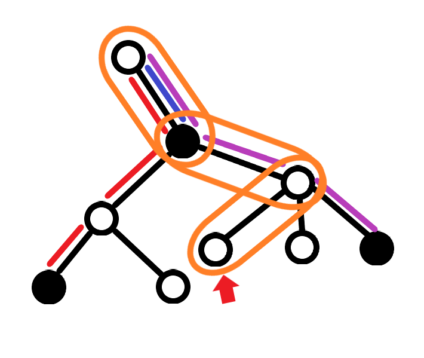

# 我要成為海賊王
https://tioj.ck.tp.edu.tw/problems/1171

## Description
給定一棵樹，一開始所有頂點都是白色的，有$q$次操作，每次操作可以把一個頂點塗成黑色，或者詢問某個頂點$x$到所有黑色頂點的距離和

## Solution
可能算是經典題吧，這邊提供兩種寫法: 重心剖分和輕重鍊剖分

### 重心剖分
重心剖分的核心想法是樹分治，每次拔掉一個點，並統計有經過這個點的答案並遞迴計算沒經過該點的答案
為了確保複雜度，每次拔掉重心是一個好選擇
也許可以發現每個頂點都會當一次重心(?)
並且若把每次拔掉的重心$c$和分治下去的每個子樹找到的重心$c'$都連邊，也會是一棵樹，稱為重心樹

假設我要查詢$x$這個點，我們就枚舉$x$在重心樹上的祖先
對於所有黑色頂點$b$來說都可以找到恰一個祖先$c$使得$b,x$最後是被$c$分開的
可以想到紀錄$cnt_c, sum_c$分別代表分治到以$c$為重心的時候的子樹中，黑色節點的數量以及與$c$的距離和
加加減減就能得到答案了
算式好難推QQ去查了YP的題解才知道怎麼寫

記得在重心樹往上爬的時候必須減掉和下一層有關的一些東西，要避免有重複的邊的路徑被計算到
式子可能長得像這樣吧
$$
\sum _ {p\not=croot} sum_q + cnt_q \cdot path(q,x) - sum_p - cnt_p \cdot path(p,q)
$$
其中$q$是$p$在重心樹上的父節點

每次詢問的複雜度是重心樹的深度也就是$\mathcal{O}(\log n)$

### 輕重鍊剖分
用$b$和$B$代表黑色頂點和他們的集合，$dis_v$代表從根走到$v$的距離
把所求寫成
$$
\sum _ {b\in B} dis_x + \sum _ {b\in B} dis_b - 2\sum _ {b\in B} dis _ {LCA(b,x)} = |B|dis_x + \sum _ {b\in B}dis_b - 2 \sum _ {b\in B} dis _ {LCA(b,x)}
$$

關注最後一項，想成枚舉$x$到根的所有邊$e$
可以發現：$dis _ {LCA(b,x)}$有包含某個$e$ $\Leftrightarrow$ $b$到根會經過$e$且$x$到根會經過$e$
所以對每個邊維護一個值$sum_e$，把一個點$x$塗黑的時候就把$x$到根會經過的$sum_e$都加上$e$的長度，查詢$x$的時候就看$x$到根所有邊的$sum_e$總和
如果畫成圖大概長這樣

紅藍紫代表那個邊被加幾次，而橘色的框框代表查詢$x$要看的邊

按照慣例把算邊改成算點，用$e$深度較深的點來代表$e$
輕重鍊剖分可以把點到根的路徑分成遍歷順序的$\mathcal{O}(\log n)$個區間，再搭配一個線段樹處理「區間加值、區間加權和」就可以啦

這個寫法每次詢問的複雜度是$\mathcal{O}(\log^2n)$，如果用link-cut-tree可以到$\mathcal{O}(\log n)$的樣子

## AC code
因為1-base好像比較安全我就擅自把輸入都+1了OwO

### 重心剖分
好醜(X
``` cpp
//   __________________
//  | ________________ |
//  ||          ____  ||
//  ||   /\    |      ||
//  ||  /__\   |      ||
//  || /    \  |____  ||
//  ||________________||
//  |__________________|
//  \###################\
//   \###################\
//    \        ____       \
//     \_______\___\_______\
// An AC a day keeps the doctor away.

#pragma GCC optimize("Ofast,unroll-loops,no-stack-protector")
#pragma loop_opt(on)
#include <bits/extc++.h>
#ifdef local
#define debug(x) (cerr<<#x<<" = "<<(x)<<'\n')
#else
#define debug(x) ((void)0)
#endif // local
#define all(v) begin(v),end(v)
#define siz(v) (ll(v.size()))
#define get_pos(v,x) (lower_bound(all(v),x)-begin(v))
#define sort_uni(v) sort(begin(v),end(v)),v.erase(unique(begin(v),end(v)),end(v))
#define pb emplace_back
#define ff first
#define ss second
#define mid (l+(r-l>>1))
#define mem(v,x) memset(v,x,sizeof v)
#define int ll

using namespace std;
using namespace __gnu_pbds;
typedef int64_t ll;
typedef long double ld;
typedef pair<ll,ll> pll;
typedef pair<ld,ld> pld;
template <typename T> using max_heap = __gnu_pbds::priority_queue<T,less<T> >;
template <typename T> using min_heap = __gnu_pbds::priority_queue<T,greater<T> >;
template <typename T> using rbt = tree<T,null_type,less<T>,rb_tree_tag,tree_order_statistics_node_update>;
constexpr ld PI = acos(-1), eps = 1e-9;
constexpr ll N = 100025, INF = 1e18, MOD = 20191126, K = 20, inf = 1e9;
constexpr ll modpow(ll e,ll p,ll m=MOD) {ll r=1; for(;p;p>>=1,e=e*e%m) if(p&1) r=r*e%m; return r;}
constexpr inline ll cdiv(ll x, ll m) { return (x+m-1)/m; } // ceiling divide, x/m for flooring divide
template <typename T> void M(T &x, ll m=MOD){x%=m; if(x<0) x+=m;}

struct Edge {
    ll v,w; // v=a^b
} E[N];
int vis[N],sz[N],mxs[N],cpa[N],cdep[N];
ll dis[K][N];
vector<int> g[N],tmp;
void dfs(int u) {
    vis[u] = true, mxs[u] = 0, sz[u] = 1;
    tmp.pb(u);
    for(int id:g[u]) {
        int v = E[id].v^u;
        if(!vis[v]) dfs(v), mxs[u] = max(mxs[u], sz[v]), sz[u] += sz[v];
    }
}
void get_dis(int u,int d) { // get distance to centroid whose depth is d
    vis[u] = true;
    for(int id:g[u]) {
        int v = E[id].v^u;
        if(!vis[v]) dis[d][v] = dis[d][u]+E[id].w, get_dis(v,d);
    }
}
void deco(int u,int dep=1,int pa=0) { // centroid decomposition
    tmp.clear();
    dfs(u);
    int c = u, S = tmp.size();
    for(int i:tmp) {
        if(max(S-sz[i],mxs[i]) < max(S-sz[c], mxs[c])) c = i;
        vis[i] = 0;
    }
    dis[dep][c] = 0;
    get_dis(c,dep);
    for(int i:tmp) vis[i] = 0;
    vis[c] = true;
    cpa[c] = pa;
    cdep[c] = dep;
    for(int id:g[c]) {
        int v = E[id].v^c;
        if(!vis[v]) deco(v,dep+1,c);
    }
}
ll ans[N],re[N],cnt[N];
void update(int p) {
    for(int x = p, d = cdep[p]; x; x = cpa[x], --d) {
        ans[x] += dis[d][p];
        re[x] += dis[d-1][p];
        ++cnt[x];
    }
}
ll query(int p) {
    ll res = 0, now = 0;
    for(int x = p, d = cdep[p]; x; x = cpa[x], --d) {
        res += (ans[x] - re[x]) + (cnt[x] - now) * dis[d][p];
        now = cnt[x];
    }
    return res;
}

bitset<N> color;
signed main() {
    int n,q;
    ios_base::sync_with_stdio(0), cin.tie(0);
    cin >> n >> q;
    for(int i = 0,a,b,w; i < n-1; i++) {
        cin >> a >> b >> w, a++, b++;
        E[i] = {a^b,w};
        g[a].pb(i), g[b].pb(i);
    }
    deco(1);
    //for(int i = 1; i <= n; i++) cout << cpa[i] << " \n"[i==n];
    //for(int i = 1; i <= n; i++) cout << cdep[i] << " \n"[i==n];
    //for(int i = 1; i <= n; i++) cout << dis[1][i] << " \n"[i==n];
    while(q--) {
        int t,v;
        cin >> t >> v, v++;
        if(t == 2) cout << query(v) << '\n';
        else if(t == 1 && !color[v]) color[v] = true, update(v);
        //for(int i = 1; i <= n; i++) cout<<ans[i]<<" \n"[i==n];
    }
}
```

### 輕重鍊剖分
``` cpp
//   __________________
//  | ________________ |
//  ||          ____  ||
//  ||   /\    |      ||
//  ||  /__\   |      ||
//  || /    \  |____  ||
//  ||________________||
//  |__________________|
//  \###################\
//   \###################\
//    \        ____       \
//     \_______\___\_______\
// An AC a day keeps the doctor away.

#pragma g++ optimize("Ofast")
#pragma loop_opt(on)
#include <bits/extc++.h>
#ifdef local
#define debug(x) (cerr<<#x<<" = "<<(x)<<'\n')
#else
#define debug(x) ((void)0)
#endif // local

using namespace std;
typedef int64_t ll;
constexpr ll N = 100001, INF = 1e18, MOD = 1000000007, K = 256, inf = 1e9;

struct SegmentTree {
    ll w[N<<1],sum[N<<1];
    int laz[N],n;
    void init(int _w[],int _n) {
        n = _n;
        for(int i = 0; i < n; i++) w[i+n] = _w[i];
        for(int i = n-1; i > 0; i--) w[i] = w[i<<1]+w[i<<1|1];
    }
    void upd(int p,int d) {
        sum[p] += d*w[p];
        if(p < n) laz[p] += d;
    }
    void pull(int p) {
        while(p>1) sum[p>>1] = sum[p]+sum[p^1]+laz[p>>1]*w[p>>1], p>>=1;
    }
    void push(int p) {
        for(int h = __lg(n); h >= 0; h--) {
            int i = p>>h;
            if(!laz[i>>1]) continue;
            upd(i,laz[i>>1]);
            upd(i^1,laz[i>>1]);
            laz[i>>1] = 0;
        }
    }
    void edit(int l,int r,int d) {
        int L = l, R = r;
        for(l+=n,r+=n; l<r; l>>=1,r>>=1) {
            if(l&1) upd(l++,d);
            if(r&1) upd(--r,d);
        }
        pull(L+n), pull(R-1+n);
    }
    ll query(int l,int r) {
        ll res = 0;
        push(l+n), push(r-1+n);
        for(l+=n,r+=n; l<r; l>>=1,r>>=1) {
            if(l&1) res += sum[l++];
            if(r&1) res += sum[--r];
        }
        return res;
    }
} sgt;
struct HeavyLightDecomposition {
    struct Edge {int cost,to;};
    vector<Edge> g[N];
    int pa[N],pa_d[N];
    int sz[N],mxs[N],id[N],link_top[N];
    int weight[N],sumc,tot;
    ll dis[N],sumd;
    void add_edge(int a,int b,int c) {
        g[a].push_back({c,b});
        g[b].push_back({c,a});
    }
    void dfs(int i) {
        sz[i] = 1;
        mxs[i] = 0;
        for(auto &edge:g[i]) {
            int j = edge.to;
            int c = edge.cost;
            if(j == pa[i]) continue;
            pa[j] = i;
            pa_d[j] = c;
            dis[j] = dis[i] + c;
            dfs(j);
            sz[i]+=sz[j];
            if(mxs[i]==0 || sz[j] > sz[mxs[i]]) mxs[i] = j;
        }
    }
    void deco(int i,int t) {
        link_top[i] = t;
        weight[id[i] = tot++] = pa_d[i];
        if(mxs[i]) deco(mxs[i],t);
        for(auto &edge:g[i]) {
            int j = edge.to;
            if(j == pa[i] || j == mxs[i]) continue;
            deco(j,j);
        }
    }
    void init(int n) {
        dfs(1);
        deco(1,1);
        sgt.init(weight,n);
    }
    void poke(int x) {
        sumd += dis[x];
        ++sumc;
        while(x) {
            int y = link_top[x];
            sgt.edit(id[y],id[x]+1,1);
            x = pa[y];
        }
    }
    ll query(int x) {
        ll res = sumc * dis[x] + sumd;
        while(x) {
            int y = link_top[x];
            res -= 2*sgt.query(id[y],id[x]+1);
            x = pa[y];
        }
        return res;
    }
} HLD;
bool color[N];
signed main() {
    ios_base::sync_with_stdio(0), cin.tie(0);
    int n,q;
    cin >> n >> q;
    for(int i = 1,a,b,c; i < n; i++) {
        cin >> a >> b >> c;
        ++a, ++b;
        HLD.add_edge(a,b,c);
    }
    HLD.init(n);
    while(q--) {
        int t,x;
        cin >> t >> x, ++x;
        if(t == 1) {
            if(!color[x]) color[x] = 1, HLD.poke(x);
        }else if(t == 2) {
            cout << HLD.query(x) << '\n';
        }
    }
}
```
