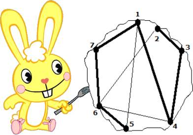

# 快樂規劃路徑

https://tioj.ck.tp.edu.tw/problems/1629

## Description
樹朋友們生活在一個湖邊，湖邊的樹依照順時針方向編號為$1, 2, \dots n$。
他們想要讓自己更快樂，所以發明了一種娛樂方式，就是找到一條路徑遍歷全部$n$棵樹剛好一遍。
要從A樹到B樹唯一的方法就是架一條很長的梯子直直伸過去。
可是當然不是任何兩棵樹都可以架梯子，所以他們會先把所有可能架梯子的樹對(沒有錯字!)給你。
當然，(A,B)表示A可以到B、B也可以到A。
但是給定的遊歷路徑不能出現任兩條梯子交叉，不然可能會讓想要快樂的樹朋友發生危險。



例如上圖粗線所示就是一個合法的快樂路徑。
給你樹的個數以及樹對，請輸出一組快樂路徑。
若有很多組解，樹朋友希望看到字典順序最小的那一組。

$5 \leq n \leq 1000$

## Solution
由不能交叉的條件可以推出，在某個時刻已經遍歷過的點一定是環上的一個連續區間
所以可以2D/0D的區間DP，並記錄最小的轉移來源

我的dp$[i][L][0]$代表的是現在站在$i$，往順時鐘方向的$L$個都已經遍歷過了，$dp[i][L][1]$也相似只是換成逆時鐘
因為實在想不到更好的實作方式所以寫的有夠醜，但是只要好好選到最小的轉移來源就會是字典序最小的路徑了

## AC code
``` cpp
#include <bits/stdc++.h>

using namespace std;
const int N = 1025;

int n, m;
bool dp[N][N][2], fr[N][N][2], g[N][N];
signed main() {
    ios_base::sync_with_stdio(0), cin.tie(0);
    cin >> n >> m;
    for(int i = 0; i < m; i++) {
        int a, b;
        cin >> a >> b, --a, --b;
        g[a][b] = g[b][a] = true;
    }
    for(int i = 0; i < n; i++) dp[i][1][0] = dp[i][1][1] = true;
    for(int L = 2; L <= n; L++) for(int i = 0; i < n; i++) {
        // dp[i][L][0]
        if(dp[(i+1)%n][L-1][0] && g[(i+1)%n][i]) { // (i+1)%n
            fr[i][L][0] = 0;
            dp[i][L][0] = true;
        }
        if(dp[(i+L-1)%n][L-1][1] && g[(i+L-1)%n][i]) { // (i+L-1)%n
            if(!dp[i][L][0] || (i+1)%n > (i+L-1)%n)
                fr[i][L][0] = 1;
            dp[i][L][0] = true;
        }
        // dp[i][L][1]
        if(dp[(i+n-1)%n][L-1][1] && g[(i+n-1)%n][i]) { // (i+n-1)%n
            fr[i][L][1] = 0;
            dp[i][L][1] = true;
        }
        if(dp[(i+n+1-L)%n][L-1][0] && g[(i+n+1-L)%n][i]) { // (i+n+1-L)%n
            if(!dp[i][L][1] || (i+n-1)%n > (i+n+1-L)%n)
                fr[i][L][1] = 1;
            dp[i][L][1] = true;
        }
    }
    for(int i = 0; i < n; i++) {
        if(dp[i][n][0] || dp[i][n][1]) {
            vector<int> ans;
            for(int c = 0; c < 2; c++) if(dp[i][n][c]) {
                int d = c;
                vector<int> vv;
                for(int L = n; L >= 1; L--) {
                    vv.push_back(i);
                    // cerr<<dp[i][L][d]<<',';
                    int f = fr[i][L][d];
                    if(d) {
                        if(f) {
                            i = (i+n+1-L)%n;
                            d = 0;
                        }else {
                            i = (i+n-1)%n;
                            d = 1;
                        }
                    }else {
                        if(f) {
                            i = (i+L-1)%n;
                            d = 1;
                        }else {
                            i = (i+1)%n;
                            d = 0;
                        }
                    }
                }
                if(ans.empty() || vv < ans) ans = vv;
            }
            for(int x: ans) cout << x+1 << '\n';
            return 0;
        }
    }
    cout << -1 << '\n';
}
```