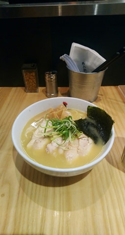
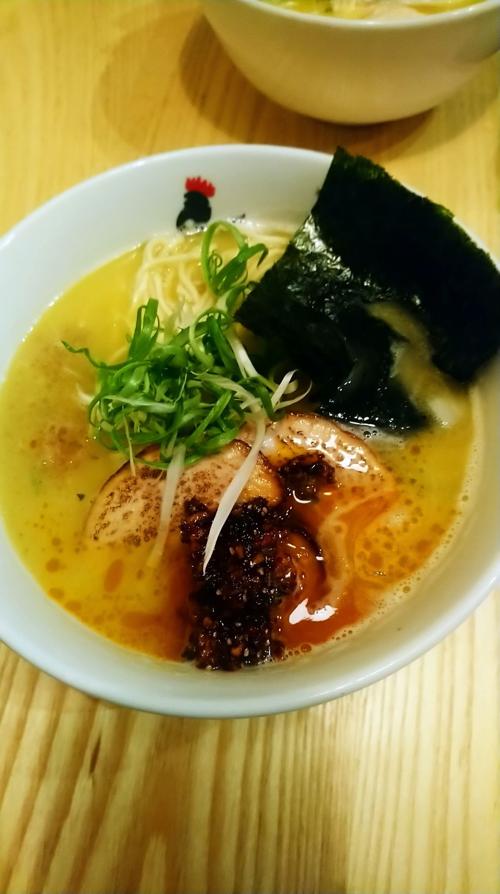
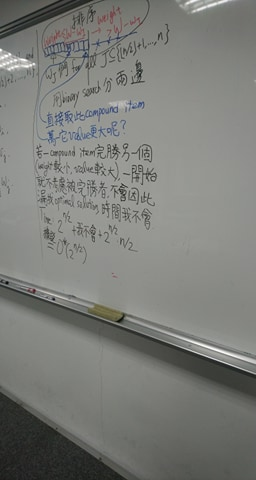
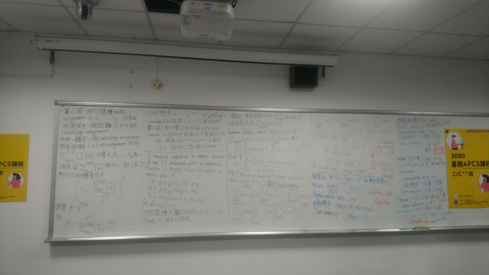
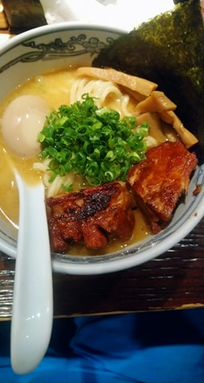

# 國培第一週
## 週五
前一天東東跟曹宸睿跑去住宿，似乎是住在捷絲旅（好好），不過他們的晚餐費只有一百元XD
至於我則是在考完資格考後又忙著去YTP初賽，並且發現自己被最後一題電爆QQ
因為17號是鳥人食雞日所以我拉一些人去ㄘ鳥人，加上加點的總共可以有八片雞肉叉燒，超爽。

## 週六
前一天不知道吃了什麼毒超早睡OAO可是起床又超晚，最後遲到了十幾分鐘到，不過好像是沒差owo
早上是王弘倫教授講IOI的詳細規則，詳細到我不知道怎麼形容。
他還講了四模pC的題解(?)還有丟一題 Christmas 類似斜率優化但是好像有四邊形優化的性質，總之一整個好強OAO。

下午跑去西門町訂做西裝，原本以為會是常常看到的那種沒什麼裝潢普通店面（海派那種），結果是一家看起來超高級的西裝店，
好像叫ElegaZzle，之前應該是完全沒聽說過
我們一群人都是穿著T-shirt加短褲還有布鞋，我一整個鄉下人長見識了(?)
選定布料還有樣式的時候選有夠久，三個人一起選還是有選擇障礙，尤其因為選擇超多，大概有幾十種布料可以選擇
選了西裝的布料後又得選領口的樣式、襯衫的布料、襯衫的樣式、鈕扣、袖口要繡上的名字blablabla。
總之做了很困難的選擇之後來到更困難的部分：量尺寸
我超胖QQ太sad了，一開始大概量了一個尺寸換上去後肚子那邊好緊（眼睛也看的出來）
然後我還被要求在門口量尺寸QQ，超級羞恥play(#
順帶一提這家店有一個很酷的房間可以掃描人體的3D模型，還有跟手機的藍芽弄一些特效，聽說曹宸睿的手機有閃退一次XD

我們每一餐的餐費是一百元，我們決定把午餐和晚餐合在一起變成兩百元，這樣就可以ㄘ拉麵了，
話說我這天也沒吃早餐，只靠一餐拉麵果腹，爽！
好笑的是今天又跑去ㄘ鳥人（因為西門町太近ㄌ而且他們上次剛好錯過）
這天嘗試了辛白湯，實在是頗辣的不過還不錯吃啦
然後後來跑去踩踩安利美特、又走到北車地下街Y區，看到好多軟軟<3<3
不過都沒買任何東西感覺有點浪費時間(#
噢，最覺得浪費時間的可能是我跑去打音遊另外兩個人站在後面看的尷尬時間。

## 周日
隔天早上沒有課，他們兩個又說晚半小時到，於是我想說可以安心吃早餐慢慢出門， 結果我還是晚他們到XD
因為我前一天不小心玩壞OJDL，所以這個早上花了不少時間來修。
一切的主因都是因為沒事update東西QQ，造成的影響到現在還沒修完
這天修好的 bug 好像是因為沙盒有限制記憶體之類的，但是 update 之後的執行檔編譯出來不知道為什麼就爆炸了(?)
好像在 `g++` 的選項加個 `-static` 就修好了，完全不知道為什麼之前不會出事更新就會出事。

下午的講師是張經略教授（對就是加菲貓教授）
他仍然超酷，講的主題是 subexponential algorithms。首先講了subset sum和0/1背包的meet in the middle作法，中途還一直說「這個部分我不會……所以時間複雜度就是 $2^{N/2}$  + 我不會 +  $2^{N/2} \cdot (N/2)$ ……」，超好笑，O(我不會)的演算法。接著講了一個 $O^{ \star }(3^{N/2})$ 的3-SAT確定性演算法，並且還有講了 $O^{ \star }(3^{N/4})$的隨機演算法和一個O(我不會)的隨機演算法XD。
接下來就變成討論「1-median selection in metric space」的一大堆東西， 這個問題主要是在問給一堆點，你要找到與其他點平均距離最小的一個點，很神奇的是可以隨機選一個夠多點的subset，然後對每個點只算與這個subset的平均距離之類的，會得到一個近似解。
教授也分享了很多相關的結果，例如壓掉一個log或是在某種條件下變成超級好的複雜度之類的
總之很難理解但是我大致上就邊開水題邊聽他講證明，可能因為我前一天晚睡超想睡覺的，最後真的累到不行了XD

下午再度拉麵行，本來要去吃雞二但是又是到現場才發現他公休，明明google有寫qqq我超雷
於是想說在附近隨便找吃的又放棄了，最後變成去中山站吃武藏神山（完全不知道為啥）
加麵真香，雖然我好像不小心選到這家略貴，不過有些許甜味的厚叉燒兩片還是值得的！粗麵和湯頭我也很喜歡。
接著就走路到北車，各自搭車解散 OwO！

## 寫題呢QQ
我本來以為會刷一些OI題，不過看來我自己也還沒什麼動力（
東東好像有一個ICPC培訓班的考試，十題裡面需要作出七題，而且全都超難的。
全部應該都是OI題，有些我想半天都想不出來QQ
我覺得我絕對就是那種少一點練習很快就退步的選手，
這幾天就先從刷CF題開始吧(#
還有希望暑假自己可以開心> <雖然很多事要掛心，不過跟其他人比起來我已經少很多煩躁ㄌ！
話說這篇圖片好多，希望大家不要在半夜點進來發現太餓(X

