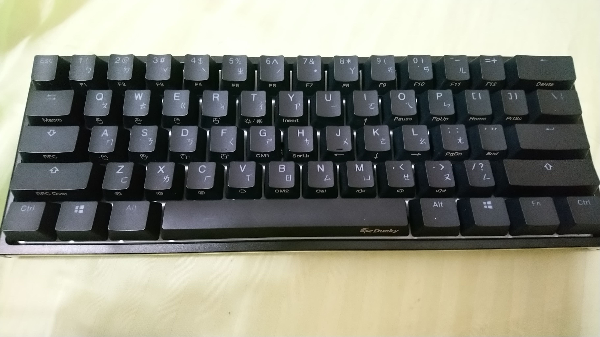

好久又沒有發文了
來講講上一次發文之後我都在做什麼好了

## Before IOI
首先在8/17開始所謂的賽前集訓
總共為期三周，分別在台南、新竹和台北
在台南的前幾天是一個奇怪的教授要我們寫爛題目
還得用PC2 judge，不過我們最後都變成在玩python in one line了
之後他又講了有關點連通、邊連通跟degree之類的關係
後來吳邦一教授來講課，他講了一些IOI的題目還有一些常見的trick，例如四邊形之類的
那時候就能看出來我超爛(((

週末是在師大上王柄豐的課
這時似乎已經累計很多他丟的題目沒寫了QQ

下一個禮拜是在清大和交大
第一天韓永楷教授早上早上上的有點基礎，不過下午上的東西還蠻有趣的
另外有遇到吳宗達跟盧可瑜(?) 還聽到了奇怪的洋蔥式資料結構
第二天是蔡孟宗教授講parametric search跟matroid之類的東西
雖然matroid和submodular的東西我是幾乎聽不懂，不過我覺得這天的課都還算是有趣
第三天是蔡錫鈞教授，我一開始感覺他不是很友善，然後外加上我超想睡，而且其實頗難的，課聽進去的沒有多少QQ
下午的時候謝旻錚教授找了hank來跟我們virtual IOI2017
想當然而我被打爆，而且AY還贏了hank，超強orzzzz
晚上被教授請客XD不過餐廳有點太高級不敢吃什麼東西
周五的時候謝旻錚教授講了一些計算幾何的東西，感覺只要提到簡單多邊形就是超級噁心的@@

回到台北之後都是王柄豐的課了
終於聽到了toptree，不過還沒有實作過QQ
然後也把之前ICPC的題目程式碼給補了一點點
啊IOI也vir了幾場 可是總感覺沒有胸有成竹的感覺
只能說IOI比成這樣真的是自己練習不足啊

在集訓完到IOI這中間有空一個禮拜，而且還是在開學期間，實在有夠尷尬
總之我把他當成有公假，而我們的校內賽初賽也是在這個禮拜，正好可以回去確認狀況以及去校內培訓玩玩(?)

話說我們這屆的人能出校內賽其實算神奇
原因是因為我們幾個有進過全國賽不會在北市賽佔到建中的名額，所以老師就找我們來出題目
雖然我們出的題目好像沒有說很好QQ
不過初賽感覺問題比較像是當天流程沒有仔細check好QQ

## After IOI
回到教室有種更尷尬的感覺
不過總之周一下午跟著蕭梓宏他們跑去台大上了微積分一
前面幾堂講的實在好基礎(#)
另外我周三和周五的早上有去旁聽線性代數
上了幾天的課之後
我發現我就算沒去台大修課，大家也剛好會去，因為班上沒人自然就沒辦法上課
再加上我也沒有修這學期的數理課程，事實上我幾乎沒有課需要上啊OAO
要擔心的只有國文/英文/藝術與生活/體育，我覺得英文應該是最佳選擇

我上微積分的第二個禮拜就開始感覺困難了orz
總之希望是可以好好修完
校內賽複賽變成是有點尷尬，因為我們流程是我們出題、老師選題，啊又剛好沒選到太多水題或是學長的題目QQ
我覺得我應該當初直接寫出來說推薦可以直接選哪些題
而且老實說也應該出幾題培訓有講過的東西，自己的盲點真的自己看不到@@
大家當天的分數普遍都很低
不過至少最後預期會進的人大部份都進了，還算是幸運

在中秋連假的時候我買了一把新鍵盤，是ducky one的60%紅軸，用起來真的只能說超爽的wwww紅軸軟又軟，啊鍵位也都整個習慣了之後小巧的它就很有魅力wwww
現在我的書包裡面除了筆電跟軟軟以外還多了鍵盤這個常駐物品
Esc離手指超近而且方向鍵又被拔掉超爽的XDDDD
可是有一個重大問題是用注音打字的時候我習慣按方向鍵XDD 所以還是得跑去弄組合鍵
總之，希望我以後還能夠常常用到這把鍵盤，還有希望他能陪我很久

