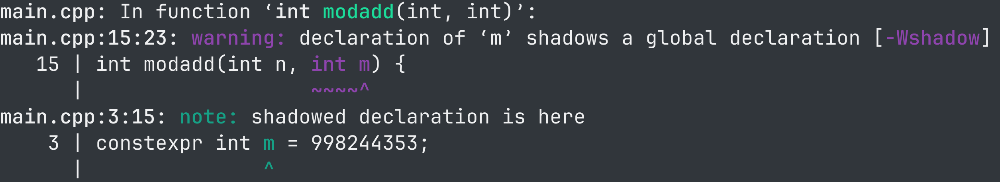
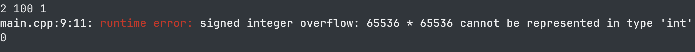
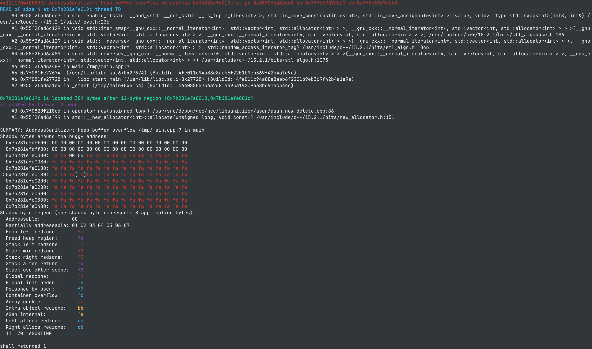

# fsanitize 與編譯警告

介紹一下 fsanitize 與編譯警告這兩個能夠幫助 debug 以及減少 bug 的工具。

寫程式[^context]一定會遇到 bug。
雖然 debug 這件事並沒有銀色子彈的存在，但 sanitizer 與編譯警告可以幫助我們簡單的排除一整類的 bug，保持我們的 san 值。

[^context]: 本文的 context 應該是在 ICPC/OI 中寫 C++。

## 懶人包

### 手動編譯

參考指令（假設想要把 `main.cpp` 編譯成 `main`）：

```bash
g++ -Wall -Wextra -Wshadow -Wconversion \
    -g -fsanitize=address,undefined \
    main.cpp -o main
```

### Code::Blocks (?)

Settings > Compiler > Global compiler settings，然後把 `-Wall` `-Wextra` `-Wshadow` 等 flags 都勾起來。其他參數可以填在 Other compiler options。

其中，`-fsanitize=address,undefined` 這個參數基本上只有 Linux 能用[^platform]，所以推薦打競程的人裝 Linux（？）。

[^platform]: 根據 <https://github.com/google/sanitizers/wiki/AddressSanitizer> 的表格，FreeBSD 跟 OS X 其實也支援，但架構必須要是 x86/x86_64 的，也就是說如果是 MacBook M1~M4 的話，目前無法原生使用。

### 例1

```cpp
#include <iostream>

constexpr int m = 998244353;
int modpow(int e, int p) {
  int r = 1;
  while (p) {
    if (p & 1)
      r = r * e % m;
    e = e * e % m;
    p >>= 1;
  }
  return r;
}

int modadd(int n, int m) {
  return (n + m) % m;
}

int main() {
  int a, b, c;
  std::cin >> a >> b >> c;
  std::cout << modadd(modpow(a, b), c) << std::endl;
}
```

假設我們用前述的編譯指令編譯上面的 cpp 檔，則應該會發現 `modadd` 函數中的 `m` 與全域變數 `m` shadow 了。

實際執行還會發現 `modpow` 裡面沒有用 `long long` 導致溢位，會印出帶有顏色的錯誤訊息（顏色 depends on terminal 的種類和設定，不一定是這個顏色）。


### 例2

```cpp
#include <algorithm>
#include <vector>
#include <iostream>

int main() {
  std::vector<int> arr = {1, 2, 3};
  std::reverse(arr.begin(), arr.begin() + 100);
}
```

以上是一段會觸發 addresss sanitizer 的程式，實際執行之後會印出如下的錯誤訊息並以 exit code 1 強制結束程式。


錯誤訊息上方有一段寫了好幾個函式的 signature、檔名、行號，是錯誤發生點時的 calling stack 的長相，通常來說 debug 時就是從上往下看，關注前幾個出現在 main 裡面的地方，像這張截圖就是 `main.cpp` 的第七行中我們因為傳了錯的參數給 `reverse` 才導致記憶體戳出界。這裡會好好的寫檔案跟行號是因為我們有加 `-g` 這個參數，如果沒有加的話只會顯示函數的位址。

## Sanitizers

接著為了推銷大家使用 sanitizer，就來介紹一大團 sanitizer 可以幫忙檢測到的 bug。

本段測試時使用的 `g++` 版本是 `g++ (GCC) 15.2.1 20250813`，編譯參數都是

```bash
g++ -std=gnu++20 -Og \
    -g -fsanitize=undefined,address \
    main.cpp -o main
```

### integer overflow

```cpp
#include <iostream>

constexpr int mod = 998244353;
int modpow(int e, int p) {
  int r = 1;
  while (p) {
    if (p & 1)
      r = r * e % mod;
    e = e * e % mod;
    p >>= 1;
  }
  return r;
}

int main() { std::cout << modpow(2, 100) << std::endl; }
```

順便科普一下 signed integer 的 overflow 是 UB 但 unsigned 不是[^unsigned_overflow]，unsigned integer overflow 會截斷超出去的部份，因此如果真的想要計算 $\mod 2^{32}$ 的加減乘法，使用 `unsigned` 或 `uint32_t` 等是合法的。

[^unsigned_overflow]: [stackoverflow 串](https://stackoverflow.com/questions/16056758/c-c-unsigned-integer-overflow) [reddit 串](https://www.reddit.com/r/cpp_questions/comments/1bgnjgi/clarification_on_ub_of_unsigned_integer_overflow/) 。可以使用 `-fwrapv` 或 `-fno-strict-overflow` 來讓 signed integer 也 wraparound。

另一個經典的 overflow 例子是把 `INT_MIN` 除以 -1，不過應該很少人會踩到。

注意因為有 integer promotion 的存在，有些比 int 小的型別之間的運算 overflow 其實不是 UB [^int_promotion_not_ub]（這次查資料學到的）。

[^int_promotion_not_ub]: 以下的 overflow 都不會被當作 UB（詭譎）
    ```cpp
    #include <climits>
    #include <cstdint>
    #include <iostream>

    int main() {
      int16_t a = 32760;
      int16_t b = 32760;
      int16_t sum = a + b;
      std::cout << sum << std::endl;

      signed char c = SCHAR_MAX;
      std::cout << int(c) << std::endl;
      c++;
      std::cout << int(c) << std::endl;
    }
    ```

### shift

```cpp
#include <iostream>

int main() {
  int x = 998244353;
  int y1 = 39;
  int y2 = -8;
  int l1 = x << y1;
  int l2 = x << y2;
  int r1 = x >> y1;
  int r2 = x >> y2;
  std::cout << l1 << ' ' << l2 << std::endl;
  std::cout << r1 << ' ' << r2 << std::endl;
}
```

左移跟右移運算子在 shift 的量超出範圍的情況是 UB，例如 `int` 最多只能左移/右移 31 位。

印象中以前踩過一個坑是在實做 `rotl` 函數時，以下的實做其實是 UB（注意 `s = 0` 的 case），傳上去 WA 了之後對拍才找到。

```cpp
uint32_t rotl(uint32_t x, int s) {
  assert(0 <= s && s < 32);
  return (x << s) | (x >> (32 - s));
}
```

### 戳到不合法的記憶體 / 戳到陣列外

```cpp
#include <iostream>
int arr[3] = {1, 2, 3};
int main() {
  int x;
  std::cin >> x;
  std::cout << arr[x] << std::endl;
}
```

```cpp
#include <algorithm>
#include <array>
#include <iostream>

int main() {
  std::array<int, 3> arr = {1, 2, 3};
  int x;
  std::cin >> x;
  std::reverse(arr.begin(), arr.begin() + x);
}
```

```cpp
#include <algorithm>
#include <iostream>
#include <vector>

int main() {
  std::vector<int> arr = {1, 2, 3};
  int x;
  std::cin >> x;
  std::reverse(arr.begin(), arr.begin() + x);
}
```

以上三段程式碼如果輸入 `x = 10`，sanitizer 就會報錯（我測試的結果分別是 global-buffer-overflow 跟 stack-buffer-overflow 跟 heap-buffer-overflow，即你戳到不該戳的記憶體了）

```cpp
#include <iostream>

struct Foo {
  int before[100];
  int arr[3];
  int after[100];
} obj;

int main() {
  int x;
  std::cin >> x;
  std::cout << obj.arr[x] << std::endl;
}
```

以上這段程式碼如果輸入 `x = -50` 或 `x = 50` 都會得到類似以下的錯誤訊息

```txt
main.cpp:12:25: runtime error: index -50 out of bounds for type 'int [3]'
```

> (J.2) ...
> An array subscript is out of range, even if an object is apparently accessible with the given subscript (as in the lvalue expression a[1][7] given the declaration int a[4][5]) (6.5.6).

> (6.5.6) ...
> If both the pointer operand and the result point to elements of the same array object, or one past the last element of the array object, the evaluation shall not produce an overflow; otherwise, the behavior is undefined.

前段引用自 <https://www.dii.uchile.cl/~daespino/files/Iso_C_1999_definition.pdf>。陣列的索引超出界本身就是一個 UB [^container_of]，即使我們知道相對應位址存著一些合法的資料。

[^container_of]: 延伸閱讀：<https://stackoverflow.com/questions/25296019/can-a-container-of-macro-ever-be-strictly-conforming>

### 該 return 的沒 return

```cpp
#include <iostream>

constexpr int mod = 998244353;
int add(int &a, int b) {
  a += b;
  if (a >= mod)
    a -= mod;
}

int main() {
  int a = 3;
  int b = 998244352;
  add(a, b);
  std::cout << a << std::endl;
}
```

`add` 函式的回傳值型別不是 `void`，但函式執行完卻沒有 `return`，這是一個 UB。可以選擇把 `add` 改成 `void`，或者是在 `add` 裡面好好 `return`。

### unreachable

此類主要是搭配 `__builtin_unreachable` 使用。`__builtin_unreachable` 的意思是告訴編譯器說我們保證程式不會執行到這一個 statement，以此可以來做一些優化。sanitizer 能夠偵測到原本應該 unreachable 的地方被執行了，讓我們可以重新檢視 assumption 是不是對的，或是漏了什麼 edge case。

```cpp
#include <iostream>

char cyclic_rgb(char ch) {
  // assume that ch is 'r', 'g' or 'b'
  if (ch == 'r') return 'g';
  if (ch == 'g') return 'b';
  if (ch == 'b') return 'r';
  __builtin_unreachable();
}
int main() {
  std::cout << cyclic_rgb('R') << std::endl;
}
```

C++23 有一些像是 `std::unreachable()` 跟 `[[assume(cond)]]` 等看起來比較現代（？）的語法。不過 `std::unreachable()` 看起來沒有跟 sanitizer 的這一項整合。

### invalid builtin

傳 0 給 `__builtin_clz` 跟 `__builtin_ctz` 都是 UB [^why_builtin_ub]。

[^why_builtin_ub]: 可參考 <https://stackoverflow.com/questions/19527897/how-undefined-are-builtin-ctz0-or-builtin-clz0>

```cpp
#include <iostream>
int main() {
  int Z;
  std::cin >> Z;
  std::cout << __builtin_clz(Z) << std::endl;
}
```

很詭譎的是如果 Z 是 constexpr 的 0 的話不知道為什麼 sanitizer 不會叫。

現在已經是 2025 年了，請用 `std::__lg` 或更好的 `std::popcount` `std::bit_width` `std::bit_ceil` `std::countr_zero` 而不是 `__builtin` 系列（？）

### stack-overflow

```cpp
#include <iostream>
int fib(int x) {
  if (x == 0) return 0;
  if (x == 1) return 1;
  return fib(x - 1) + fib(x - 2);
}
int main() {
  int x;
  std::cin >> x;
  std::cout << fib(x) << std::endl;
}
```

以 `x = -1` 作為輸入的話，會到不了終止條件，造成無窮遞迴。

### use after scope

一個變數過了其生命週期之後，仍然有指標（或參考）去存取該變數，是一種 UB。

```cpp
#include <iostream>
#include <vector>
#include <utility>

int main() {
  std::vector<std::pair<int, int*>> q;
  {
    int local_var = 7;
    q.emplace_back(1, &local_var);
    local_var = 42;
  }
  std::cout << *q.back().second << std::endl;
}
```

在大括弧這個 scope 結束之後，`local_var` 佔用的記憶體空間就應該要被釋放了，舊的指向它的指標就失效了。

```cpp
#include <iostream>
#include <vector>
#include <utility>

int main() {
  std::vector<std::pair<int, int&>> q;
  std::vector<int> ans;
  ans.push_back(7);
  q.emplace_back(1, ans[0]);
  ans.push_back(8);
  ans.push_back(9);
  ans.push_back(10);

  std::cout << q.back().second << std::endl;
}
```

對 `std::vector` `push_back` 的時候有可能會把整個容器打掉重新 allocate，於是原本的參考就變無效了。在一些離線的題目需要小心不要寫出這樣的程式碼。

```cpp
#include <iostream>
#include <vector>

int main() {
  const int n = 20, m = 20;
  auto check = [&](int x, int y) {
    std::vector<bool> ok(n * m);
    return ok[x * m + y];
  };
  std::cout << check(0, 0) << std::endl;
}
```

上面這段 code 在這個部落格有貼過一次。`vector<bool>` 的 `operator[]` 的回傳型別是一個他自訂的 reference 物件，因此上面的 lambda function 會推斷回傳型別就是該物件而不是 `bool`，然而回傳的物件其實指向一個已經被銷毀的 `vector` `ok`。沒事不要用 `vector<bool>` 搞自己（？）

### 其他

- dereference 空指標
- load invalid bool/enum
- use after free / double free / invalid free
  - `pwn` 的一大主題之一。但在競程中一般可以不 free。
- memory leak
  - 但你不 free 的話 sanitizer 就會跟你抱怨有 memory leak。
- 檢查 VLA 的 size
  - 但拜託不要用 VLA

### Caveats

- 某些 kernel 設定（ASLR entropy 過大）下會導致什麼都沒做 sanitizer 也會報錯。[issue link](https://github.com/google/sanitizers/issues/1614)
    解決方法：在本機測試時可以 disable ASLR 跑
    參考指令：`setarch $(uname -m) -R ./main`
- 寫持久化線段樹之類的時候 Leak 很吵
    解決方法：使用環境變數設定不要偵測 Leak。
    參考指令：`ASAN_OPTIONS=detect_leaks=0 ./main` 或把環境變數放進 `~/.bashrc` 等
- UBSAN 對於比較不致命的 UB（例如溢位）不會 abort，而是只輸出錯誤訊息就繼續執行
    解決方法：使用環境變數設定
    參考指令：`UBSAN_OPTIONS=print_stacktrace=1:halt_on_error=1 ./main`
- 沒辦法偵測「無副作用的無窮迴圈」，即 [我寫程式發現費馬最後定理有反例了！](https://en.cppreference.com/w/c/language/behavior.html)
    解決方法：不知道，感覺像停機問題
- 開了 sanitizer 之後程式會跑比較慢，而且記憶體用量也會變多
    解決方法：對拍如果想要測速度的時候不要開 sanitizer（可以只開編譯警告，不會影響程式執行速度）

另外，ckiseki 的模板在 sanitizer 的部份有加上 float-divide-by-zero,float-cast-overflow，多檢查一些跟浮點數有關的東西。

## `_GLIBCXX_DEBUG`

`_GLIBCXX_DEBUG` 是一個可以開啟 STL 的 debug 模式的 macro。如果只開 sanitizer 的話，以下這段 code 在 `*map_int.end()` 的部份是不會報錯的：

```cpp
// #define _GLIBCXX_DEBUG
#include <string>
#include <iostream>
#include <map>
int main() {
  std::map<int, int> map_int;
  std::map<int, std::string> map_string;
  map_int[1] = 234;
  {
    auto [first, second] = *map_int.end();
    std::cout << first << ' ' << second << std::endl;
  }
  map_string[5] = "678";
  {
    auto [first, second] = *map_string.end();
    std::cout << first << ' ' << second << std::endl;
  }
}
```

而如果把第一行 `#define _GLIBCXX_DEBUG` 取消註解的話，`*map_int.end()` 就會報錯了（也可以在編譯參數加上 `-D_GLIBCXX_DEBUG`）。不過 `_GLIBCXX_DEBUG` 會大幅增加編譯時間因此 ckiseki 的模板沒有採用（？）（目前在我的筆電上測大約是 1.63s vs 6.25s）而且我也不知道怎麼讓 `_GLIBCXX_DEBUG` 印出 stack trace。

## 編譯警告

遵守編譯警告，維持乾淨 coding style。如果你開了警告，請不要忽視任何警告，不然有一天會發現一群你認為是 false positive 的警告裡面藏了一個重要的警告。

本段使用的測試編譯指令為

```bash
g++ -std=gnu++20 \
    -Wall -Wextra -Wshadow -Wconversion \
    main.cpp -o main
```

### shadowing

最常見的笨 shadow 問題就是全域變數放 $n$，然後在區域變數又放了一個 $n$。

```cpp
#include <iostream>

int n;
int arr[1 << 20];
void pre() {
  for (int i = 1; i < n; i++)
    arr[i] += arr[i - 1];
}

int main() {
  int n;
  std::cin >> n;
  for (int i = 0; i < n; i++)
    std::cin >> arr[i];
  pre();
  for (int i = 0; i < n; i++)
    std::cout << arr[i] << (i+1==n ? '\n' : ' ');
}
```

原則上 scope 越大的變數（例如全域變數）用較長的名字，scope 越小的變數用較短的名字（例如 for 中的 i），不僅比較不會 shadow 也比較好看懂程式碼。

順帶一提，[Member initializer list](https://en.cppreference.com/w/cpp/language/initializer_list.html) 的 shadow 我認為也是應該避免的，這樣才能輕鬆分清究竟是「傳進來的 `n`」還是「自己的 member `n`」。我個人習慣採用前綴 `t_` [^t_prefix] 來避免這部份的 shadow。

```cpp
struct Point {
  int x, y;
  Point(int t_x, int t_y) : x(t_x), y(t_y) {}
};
struct Segtree {
  int n;
  vector<int> sum;
  Segtree(int t_n) : n(t_n), sum(t_n * 2) {}
};
```

[^t_prefix]: <https://github.com/cpp-best-practices/cppbestpractices/blob/master/03-Style.md#distinguish-function-parameters>

### unused

沒有用到的區域變數通常是 code 還沒有寫完的徵兆。

```cpp
#include <iostream>

int main() {
  double a, b, c;
  std::cin >> a >> b >> c;
  double D = b * b - 4 * a * c;
  double ans = -b / (a * 2);
  std::cout << ans << std::endl;
}
```

匿名 namespace 的成員、static 函式或變數、未用到的函數參數也都會被警告。

```cpp
#include <iostream>

namespace {

int foo(int, int b, int) { return b / 2; }

int bar(int a, int b, int c) { return b / 2; } // unused a, c

int f(int x) { return x / 2 + x / 3; }

int g(int x) { return 1; } // unused x, g

} // namespace

static int h(int x) { return 2; } // unused x, h

int public_func(int x) { return 3; } // unused x

int main() {
  int n;
  std::cin >> n;
  int sum = f(n);
  std::cout << sum << std::endl;
}
```

### 未初始化

提醒你忘了 `cin >> n` 之類的忘記初始化的 bug。

```cpp
#include <algorithm>
#include <iostream>
#include <vector>

int main() {
  int n;
  std::vector<int> v(n);
  for (int &x : v) std::cin >> x;
  std::ranges::sort(v);
  std::cout << v[n / 2] << std::endl;
}
```

### -Wconversion

警告 implicit conversion。例如下面這段程式碼，`1LL * n * (n + 1) / 2` 的型別是 `long long`，而 `int sum = 1LL * n * (n + 1) / 2` 的意思是把這個 `long long` 轉型成 `int` 存在 `sum`，轉型造成的截斷不算是 UB。

```cpp
#include <iostream>

int main() {
  int n;
  std::cin >> n;
  int sum = 1LL * n * (n + 1) / 2;
  std::cout << sum << std::endl;
}
```

如果你想做的正是強制轉型（例如你保證算出來的一定在 `int` 範圍內，或是你就是要截斷過後的值），要避免此警告，可以在程式碼中加上 explicit conversion，例如 C-style 的 `(int)(1LL * n * (n + 1) / 2)`，或是 `static_cast<int>(1LL * n * (n + 1) / 2)`。

### -Wmisleading-indentation

因為不小心按到分號之類的原因，縮排跟實際上程式的結構不符合（推薦 `clang-format`）。

```cpp
#include <iostream>

int main() {
  int n;
  std::cin >> n;
  int sum = 0, cnt = 0;

  auto simulate = [&]() {
    auto x = rand() / double(RAND_MAX);
    auto y = rand() / double(RAND_MAX);
    x = x * 2 - 1;
    y = y * 2 - 1;
    if (x * x + y * y <= 1);
      ++sum;
    ++cnt;
  };

  for (int i = 0; i < n; i++);
    simulate();
  std::cout << sum / double(cnt) * 4 << std::endl;
}
```

### 無窮遞迴

一般來講是忘了寫 base case

```cpp
#include <iostream>

int collatz_steps(int n) {
  if (n % 2 == 0) return collatz_steps(n / 2) + 1;
  else return collatz_steps(n * 3 + 1) + 1;
}

int main() {
  int n;
  std::cin >> n;
  std::cout << collatz_steps(n) << std::endl;
}
```

### printf/scanf

printf/scanf 的 format string 跟後面的變數型別沒對上的話會警告。

```cpp
#include <cstdio>

int main() {
  int n;
  scanf("%u", &n);
  long long sum = 1LL * n * (n + 1) / 2;
  printf("%d", sum);
}
```

### 其他

- Class 成員初始化順序
  - 在 [Member initializer list](https://en.cppreference.com/w/cpp/language/initializer_list.html) 裡面指定的順序跟實際上初始化的順序不一樣。
- `-Wsequence-point`，即 `f(i++, i)` 或 `i++ + i++` 的 UB
- `-Wunknown-pragmas`，基本上是你 pragma 打錯了
- 除以零（僅限編譯期就知道分母是 0 的情況）
- 該 return 的沒 return
  - sanitizer 會報錯，編譯也會給你警告。

順帶一提，雖然跟編譯警告沒什麼關係，存在一個 `-Wfatal-errors` 的 flag，可以讓編譯器在遇到第一個編譯錯誤的時候就停止編譯並只印出相關的錯誤，讓編譯器不會一次吐出所有錯誤訊息，在這邊順便推銷一下。

<!-- Unreachable code -->

## 結語

本來想推銷 sanitizer 保持大家的 san 值，但查了一堆資料之後我懷疑這篇文章只會降低 san 值。C++ 真是一個奇怪的語言。

## References

- <https://blog.austint.in/2024/02/16/address-sanitizer-intro.html>
- <https://gcc.gnu.org/onlinedocs/gcc/Warning-Options.html>
- <https://gcc.gnu.org/onlinedocs/gcc/Instrumentation-Options.html>
- <https://clang.llvm.org/docs/AddressSanitizer.html>
- <https://clang.llvm.org/docs/UndefinedBehaviorSanitizer.html>
- <https://stackoverflow.com/questions/30809022/how-can-i-break-on-ubsan-reports-in-gdb-and-continue>
- <https://stackoverflow.com/questions/40677575/gcc-fsanitize-bounds-strange-behaviour-with-stdarray>
- <https://ithelp.ithome.com.tw/m/articles/10287944>
