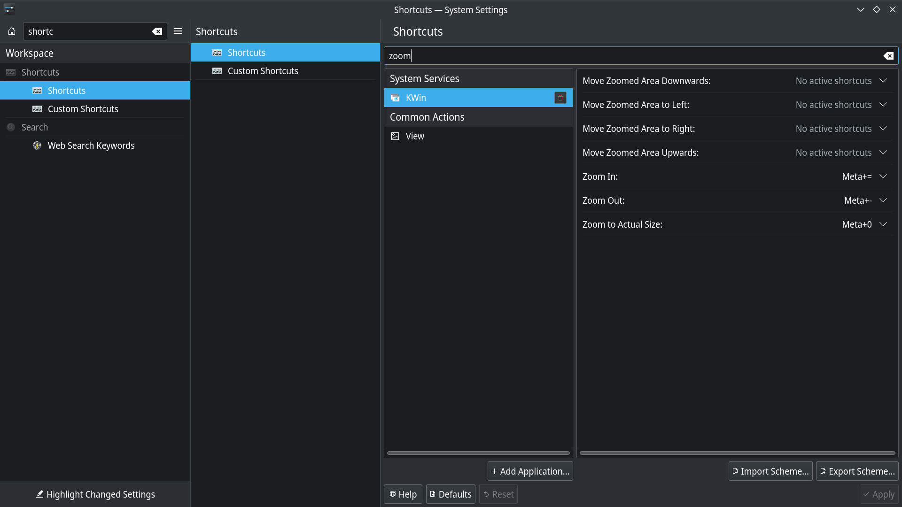
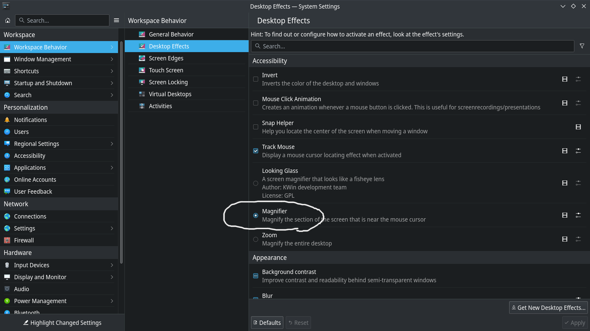
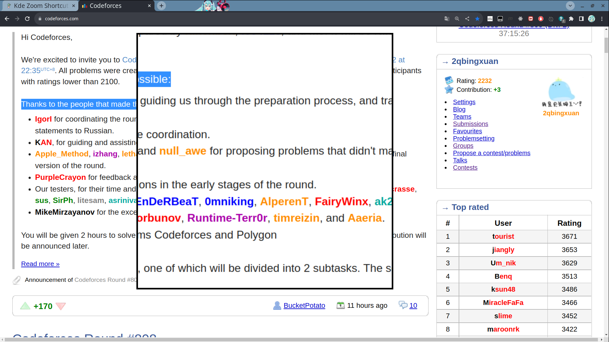

# KDE Zoom In/Out

一篇已知用火的廢文。

在第一次換成 linux 之後發現的一個 windows 的好處就是，我只要用觸控版兩根手指同時向外滑，就可以滑順的放大螢幕某個部份，並且是以游標為中心被放大。
換成 Ubuntu 之後，沒有了這樣的手勢其實有點不習慣。

在換成 Arch+KDE 之後，也早就已經習慣用瀏覽器內建的 `ctrl + =`、 `ctrl + -` 來縮放了，但缺點是不會以游標為中心放大，並且會 trigger RWS，改變排版，此外放大的比例比較離散，會有一段一段跳的感覺。
不過前幾天意外按到 `meta + =`（`meta` 鍵相當於 `win` 鍵），發現自己螢幕被放大了！已知用火的感覺真好。

經過一番探索之後，我發現這是 KDE 中 KWin 的 Zoom In / Zoom Out 功能，只要按 `meta + =` 或 `meta + -` 就可以放大整個螢幕，並且游標超出去的時候會跟著平移放大的部份。

今天要發文的時候發現有 magnify 這個功能，在 Desktop Effect 當中可以調整，用起來感覺使用者體驗更好一點

用起來大概長這樣

