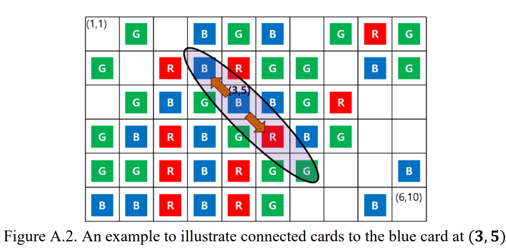
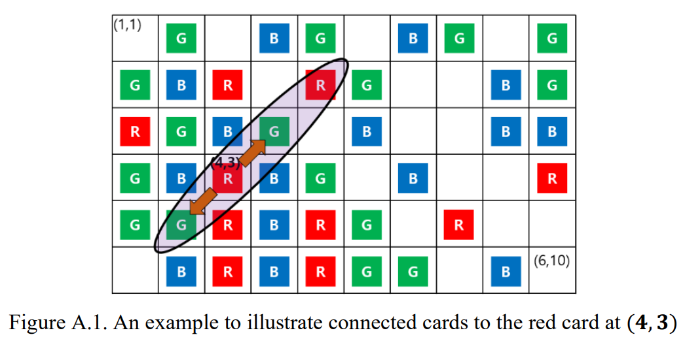
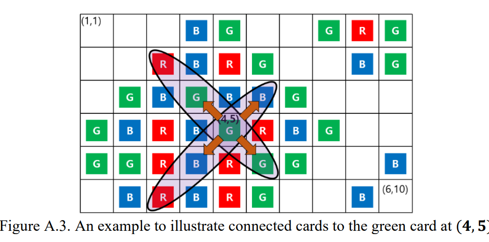

# Card Game

## Description
給定一個 $N \times M$ 的棋盤，上面每格各擺了一個 $R, G, B$ 三種顏色之一的棋子
接著雙方開始輪流操作，不能操作者就輸了，問你先手還是後手贏。

輪到一個人時他可以做的操作有三種：
- 選一個顏色 $B$ 的棋子，從該棋子的位置開始分別沿著主對角線方向走直到走到一個沒有棋子的格子或走出棋盤外，並移除那些路上經過的有棋子的格子裡面的棋子。
- 選一個顏色 $G$ 的棋子，從該棋子的位置開始分別沿著主及副對角線方向走直到走到一個沒有棋子的格子或走出棋盤外，並移除那些路上經過的有棋子的格子裡面的棋子。
- 選一個顏色 $R$ 的棋子，從該棋子的位置開始分別沿著副對角線方向走直到走到一個沒有棋子的格子或走出棋盤外，並移除那些路上經過的有棋子的格子裡面的棋子。

可以看圖更清楚：





$1 \leq N, M \leq 25$

## Solution

順便用這題來講一下 SG 定理。

### 無偏博奕 / 不偏賽局
> 在組合賽局理論裡，不偏賽局是一類任意局勢對於遊戲雙方都是平等的回合制雙人遊戲。

我們在這篇文章中對遊戲做以下的假設：
1. 遊戲是兩個玩家輪流玩。
2. 遊戲沒有平局，在有限步後一定會分出勝負。
3. 完全訊息，所有玩家都能看到整個局勢。
4. 局面對雙方來說平等，也就是說如果給定目前的局面，輪到哪個玩家玩可以做的動作以及導致的新盤面都要一樣。
5. 沒有動作可以動的人輸。

可以證明給定一個局面之後，一定是「下一個玩的人贏」或是「下一個玩的人輸」。
分別簡稱兩者為必勝態和必敗態。
<!-- （後面我可能會交替用局面/狀態來指稱同一個意思） -->

因為遊戲在有限步內會分出勝負，所以如果把局面當成節點，並且把做動作之後可以到達的局面連有向邊，形成的圖會是一張 DAG。
按照 DAG 的拓樸順序就可以算出每個局面是必勝態或必敗態。

然而通常來說所有從起始局面可以走到的局面會是指數級的，例如 nim game 會是 $\prod {h_i}$ 之類的，我們通常不能真的這樣建出 DAG。

### SG 定理
上述的無偏博奕裡，每一個局面可以唯一對應到一個 nimber，或者我們常稱這個局面的 SG value。
可以把 nimber 當成一個非負整數 $x$。在 nim game 當中只有一堆的 $x$ 個石頭的局面對應的 nimber 就是 $x$。
一個局面對應的 nimber $x$ 代表這個遊戲中的這個局面等價於 nim game 當中 $x$ 個石頭的局面。

假設一個局面 $u$ 做一個動作可以走到的局面集合是 $V(u)$，那局面 $u$ 的 SG value 可以遞迴的定義為
$$
sg(u) = \operatorname{mex}_\limits{v \in V(u)}(sg(v))
$$
其中一堆數字的 $\operatorname{mex}$ 是最小沒有出現在這些數字中的非負整數。
SG value 為 $0$ 的局面是必敗態，而非零的盤面都是必勝態。

#### Adding Games Together
SG 最重要的就是，假設有一個新的遊戲 $C$ 是兩個人同時在玩兩個遊戲 $A, B$，每個人每回合必須恰好在其中一個遊戲做動作，兩個遊戲之間是獨立的。如果我們用 $c = a + b$ 指涉遊戲 $C$ 的局面 $c$ 由遊戲 $A$ 的局面 $a$、遊戲 $B$ 的局面 $b$ 組成，那麼
$$
sg(c) = sg(a) \oplus sg(b)
$$
其中 $\oplus$ 是 bitwise XOR

nim game 不同堆之間是獨立的並且每次遊戲必須恰好在一堆做動作，藉此我們可以知道 nim game 如果每堆石頭的個數是 $h_1,\dots,h_N$，那麼此局面對應的 SG value 就是 $h_1\oplus\dots\oplus h_N$。

#### 應用：回到原題目

首先可以知道只有 $(i+j)$ 奇偶性相同的格子才會互相有影響，兩團棋子之間是獨立的兩個遊戲，也就是說我們會想要算出兩個局面的 SG value 再 XOR 在一起，最後看是不是 $0$ 來知道先手還是後手贏。
這題妙的地方在於一開始整個棋盤都是棋子。先只看某個奇偶性的棋子，適當的旋轉、伸縮之後，所有棋子的集合會是某種凸的感覺。
我們使用某個棋子之後，會把原本的棋子們切成兩團或四團互不相干的棋子，也就是說做這個動作到達的局面的 SG value 可以通過把這兩團/四團棋子的 SG value XOR 在一起算出來。
<!-- ，且這些棋子也會保有上述的性質 -->
所以我們可能會想要遞迴的計算初始局面的 SG value，會發現我們在切了幾刀之後造出的小盤面一定可以用兩個方向的區間來描述 ($l, r, d, u$ 之類的)，可以拿來當 dp 狀態，每次枚舉這個長方形裡面的棋子並看這個狀態可以到達哪些局面，再計算對應的 XOR 就是走這個棋子會到達的盤面，最後計算 mex 以得到此局面的 SG value。

複雜度是 $O((N+M)^6)$ 可能需要小心一點常數（旋轉四十五度後，$l, r, d, u$ 的範圍只需要到 $(N+M)/2$）。

## AC code

因為這題是培訓班作業所以先把 code 遮起來

```cpp
#pragma GCC optimize("Ofast")
#include <bits/stdc++.h>
using namespace std;

#define all(v) begin(v),end(v)
#ifdef too_soft
#define safe cerr<<__PRETTY_FUNCTION__<<" line "<<__LINE__<<" safe\n"
#define debug(args...) kout("\e[1;32m[ " + string(#args) + " ]\e[0m", args)
void kout() { cerr << endl; }
template <class T, class ...U>
void kout(T a, U ...b) {
  cerr << a << ' ', kout(b...);
}
template <class T>
void pary(T L, T R) {
  while (L != R) {
    cerr << *L << " \n"[++L == R];
  }
}
#else
#define safe ((void)0)
#define debug(...) safe
#define pary(...) safe
#endif

const int maxn = 55;

int dp[maxn][maxn][maxn][maxn];

int arr[maxn * maxn];
int mex(const vector<int> &s) {
  for (int x: s)
    arr[x] = 1;
  int r = 0;
  while (arr[r]) ++r;
  for (int x: s)
    arr[x] = 0;
  return r;
}

int SG(char s[maxn][maxn], int N) {
  memset(dp, 0, sizeof(dp));

  for (int l = N; l >= 0; l--) {
    for (int r = l; r <= N; r++) {
      for (int d = N; d >= 0; d--) {
        for (int u = d; u <= N; u++) {
          vector<int> tmp;
          for (int x = l; x < r; x++) {
            for (int y = d; y < u; y++) {
              if (s[x][y] == 'R') {
                tmp.push_back(dp[l][x][d][u] ^ dp[x+1][r][d][u]);
              } else if (s[x][y] == 'B') {
                tmp.push_back(dp[l][r][d][y] ^ dp[l][r][y+1][u]);
              } else if (s[x][y] == 'G') {
                tmp.push_back(
                    dp[l][x][d][y] ^
                    dp[l][x][y+1][u] ^
                    dp[x+1][r][d][y] ^
                    dp[x+1][r][y+1][u]);
              }
            }
          }

          dp[l][r][d][u] = mex(tmp);
        }
      }
    }
  }
  return dp[0][N][0][N];
}

char a[maxn][maxn];
char b[maxn][maxn];

signed main() {
  cin.tie(nullptr) -> sync_with_stdio(false);
  int N, M;
  cin >> N >> M;
  for (int i = 0; i < N; i++) {
    string s;
    cin >> s;
    for (int j = 0; j < M; j++) {
      if ((i ^ j) & 1)
        a[(i + j) / 2][(i - j + M - 1) / 2] = s[j];
      else
        b[(i + j) / 2][(i - j + M - 1) / 2] = s[j];
    }
  }

  int sa = SG(a, (N + M - 1) / 2 + 1);
  int sb = SG(b, (N + M - 1) / 2 + 1);
  debug(sa, sb);

  if (sa == sb) {
    cout << "L\n";
  } else {
    cout << "W\n";
  }
}
```
