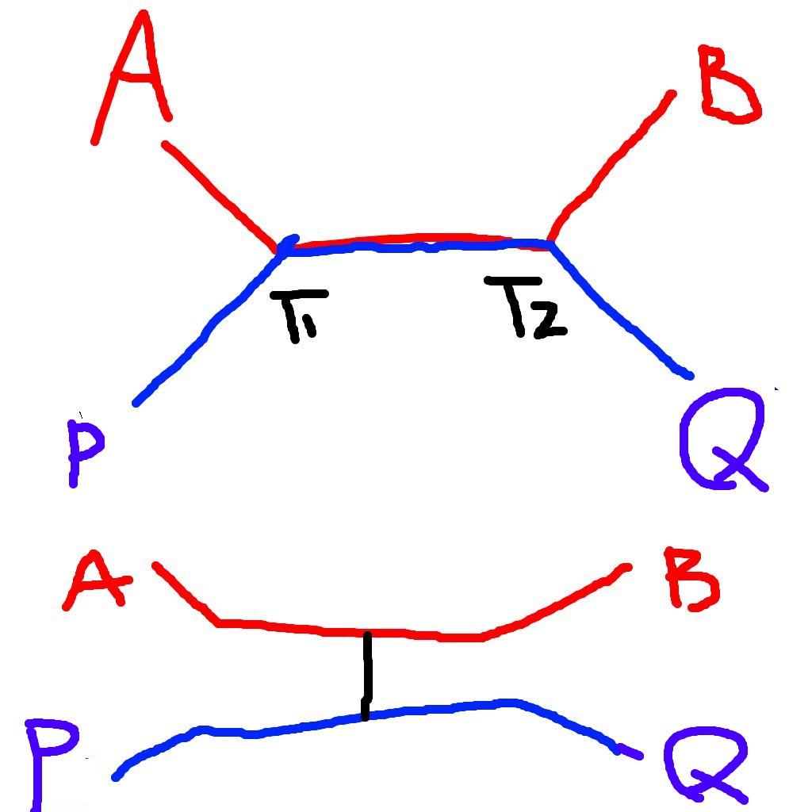

# 2021 TOI 模考

可能因為以前 TOI 模考題也不太公開，好像從來沒人做過這種事情，但因為現在模考題甚至可以在公開的 facebook 社團看到，所以我認為這樣沒有太不妥。
今年的題目相較於去年簡單很多（去年好難…），所以就嘗試把四次模擬考總共 16 題的解寫完啦～要是能幫上想做今年模考題的人就好了！

如果想在 hackmd 上看的話可以戳 https://hackmd.io/@omeletwithoutegg/TOI-2021-sols
如果只想看題目可以戳
https://www.facebook.com/notes/%E8%B3%87%E8%A8%8A%E7%AB%B6%E8%B3%BD%E9%81%B8%E6%89%8B%E6%96%B0%E6%89%8B%E6%9D%91/toi-2021/823380795202246/

<!-- [TOC] -->

## 免責條款
因為測資不一定夠強，有些解也是賽後討論才AC或是甚至只有精神AC的
所以這裡的解有可能任何錯誤或是唬爛，不可全盤相信。

註：三模跟四模的 code 幾乎都沒有丟到師大開放的臨時 judge 上跑，所以不保證正確。

## 一模
### p1 shortcut

#### 題意
定義一張圖的總花費是所有點對之間的最短距離總和。
給定一張 $n$ 點 $m$ 邊的簡單無向連通圖，在你可以加一條邊的情況下，和原圖相比最多可以減少多少總花費？又有幾種加邊的方式可以減少那麼多花費？

#### 限制
$3 \leq n \leq 500; n-1 \leq m \leq n(n-1)/2-1$

- subtask 1 (9) $n \leq 40$
- subtask 2 (22) $n \leq 150$
- subtask 3 (18) $m = n-1$
- subtask 4 (51) 無額外限制

#### 作法
- $\mathcal{O}(n^5)$
$\mathcal{O}(n^2)$枚舉要加的邊，每次重新做$n$次BFS(一次$\mathcal{O}(n+m)$)或是Floyd-Warshall
- $\mathcal{O}(n^4)$
每次枚舉要加的邊$(a,b)$時，計算每個點對的距離減少了多少，也就是$\sum_{i < j} \max(0, d(i,j) - (d(i,a)+1+d(b,j)), d(i,j)-(d(i,b)+1+d(a,j)))$，其中$d(i,j)$是原圖中$i$與$j$的最短距離，可以$\mathcal{O}(n^3)$預處理。
- $\mathcal{O}(n^3)$
前面的那個式子裡面的項代表的分別是$i\to a\to b\to j$和$i\to b\to a\to j$兩條路徑所減少的距離。可以發現這兩條路徑只有其中一條可能比原圖$i\to j$的路徑短，因為如果兩條都比原本的最短路徑短的話，那麼$i\to a\to j$或是$i\to b\to j$其中一個會是更短路徑，矛盾。
也就是說，我們在算總花費減少多少的時候可以改為計算$\sum_{ i,j}\max(0,d(i,j)-(d(i,a)+1+d(b,j)))$
考慮固定 $i,b$，那麼$j,a$之間是獨立的，我們可以拆成$\max(0,(d(i,j)-d(b,j)-1) - d(i,a))$，而對於每個$A_i$，$\sum_{j} \max(0,B_j-A_i)$是一個經典的問題，可以利用前綴和、後綴和的概念，或是排序（counting sort）+爬行法在線性時間內解決。總複雜度是枚舉所有$i,b$所需的$\mathcal{O}(n^2)$乘上對每個$a$計算$\max(0,(d(i,j)-d(b,j)-1) - d(i,a))$所需要的複雜度$\mathcal{O}(n)$，也就是$\mathcal{O}(n^3)$。

#### code
註：下面的code可能有些變數跟上面寫的不太一樣，例如$i,j,a,b$的角色可能有點顛倒。
```cpp
#pragma GCC optimize("Ofast", "unroll-loops")
#pragma loop_opt(on)
#include <bits/stdc++.h>
#ifdef local
#define debug(a...) qqbx(#a, a)
#define safe cerr<<__PRETTY_FUNCTION__<<" line "<<__LINE__<<" safe\n"
template <typename ...T> void qqbx(const char *s, T ...a) {
    int cnt = sizeof...(T);
    ((std::cerr << "\033[1;32m(" << s << ") = ("), ... , (std::cerr << a << (--cnt ? ", " : ")\033[0m\n")));
}
#else
#define debug(...) ((void)0)
#define safe ((void)0)
#endif // local

using namespace std;
using ll = int64_t;
const int maxn = 505, inf = 1e9;

int dis[maxn][maxn];
int ans[maxn][maxn];
ll sum[maxn];
int cnt[maxn];
int n, m;
signed main() {
    ios_base::sync_with_stdio(0), cin.tie(0);
    cin >> n >> m;
    for (int i = 0; i < n; i++)
        for (int j = 0; j < n; j++) 
            if (i != j)
                dis[i][j] = inf;
    for (int i = 0; i < m; i++) {
        int a, b;
        cin >> a >> b;
        --a, --b;
        dis[a][b] = dis[b][a] = 1;
    }
    for (int k = 0; k < n; k++) {
        for (int i = 0; i < n; i++) {
            for (int j = 0; j < n; j++) {
                dis[i][j] = min(dis[i][j], dis[i][k] + dis[k][j]);
            }
        }
    }
    for (int a = 0; a < n; a++) {
        for (int i = 0; i < n; i++) {
            for (int j = 0; j < n; j++) sum[j] = cnt[j] = 0;
            for (int b = 0; b < n; b++) {
                int d = dis[a][b] - dis[i][b] - 1;
                if (d < 0) continue;
                cnt[d] += 1;
                sum[d] += d;
                /*
                for (int j = 0; j < i; j++) {
                    ans[i][j] +=
                        max(0, dis[a][b] - dis[i][b] - 1 - dis[a][j]);
                    // \sum _ {d >= dis[a][j]} (d - dis[a][j])
                    //       where d = dis[a][b] - dis[i][b] - 1
                }
                */
            }
            for (int j = n-1; j >= 0; j--)
                sum[j] += sum[j+1], cnt[j] += cnt[j+1];
            for (int j = 0; j < i; j++) {
                int d = dis[a][j];
                ans[i][j] += sum[d] - cnt[d] * d;
            }
        }
    }

    ll mx = -1;
    int cnt = 0;
    for (int i = 0; i < n; i++) for (int j = 0; j < i; j++) {
        if (ans[i][j] == mx)
            ++cnt;
        else if (ans[i][j] > mx)
            mx = ans[i][j], cnt = 1;
    }
    cout << cnt << ' ' << mx << '\n';
}
/*
5 4
1 2
2 3
3 4
2 5

5 5
1 2
2 3
3 4
4 5
5 1
*/

```

### p2 multiple

#### 題意
給定 $n, m, k, R$，請輸出所有二進位表示法（不含前導 0）恰好有 $n$ 個 1， $m$ 個 0，且可以被 $k$ 整除的數字中，第 $R$ 大的數字。若答案不存在則輸出 impossible 。

#### 限制
$1 \leq n, m \leq 20000$
$1 \leq k \leq 500$
$1 \leq R \leq 10^9$
- subtask 1 (13) $n, m, k \leq 10$
- subtask 2 (5) $k = 3$
- subtask 3 (39) $n, m, k \leq 500$
- subtask 4 (24) $R = 1$
- subtask 5 (19) 無額外限制

#### 作法
- $n,m,k\leq 10$
可以$\mathcal{O}(2^{n+m})$枚舉所有$n$個1、$m$個0的數字
- $n,m,k \leq 500$
先考慮答案是否是impossible的問題，等價於問說所有$n$個1、$m$個0、被$k$整除，且沒有前導0的數字是否有至少$R$種。先不管前導0的問題，我們可以列出DP式
$$
f(i,j,r) = f(i-1,j,r-2^{i+j-1}) + f(i,j-1,r)
$$
其中$f(i,j,r)$代表有$i$個1、$j$個0、除以$k$餘數是$r$的數字種類。
那麼，只要看$f(n-1,m,-2^{n+m-1})$就能得知符合條件的數字有多少種。
要如何得知第$R$大的字串呢？最高位必須先填1，我們從第二高位開始看。
對於第 $i$ 位，假設填了1之後，後面剩下的後綴有$x$種方法使得整個數字是符合條件的，那麼如果$x \geq R$，我們就知道第$R$大的數字第 $i$ 位是1了，因此就繼續看下一位，求取剩下的後綴的第$R$大符合條件的字串。如果$x < R$的話，第$R$大的數字第 $i$ 位就是0，要注意的是有 $x$ 個符合條件的數字第 $i$ 會是 $1$，也就是說我們必須求取剩下的後綴的第$R-x$大的符合條件的字串。
說了那麼多其實就跟在二元樹上二分搜第$R$大的數有點類似，注意：不要找成第$R$小、不要忘記前導0、往左邊走的時候不要忘記扣掉右邊子樹大小。在計算$f$的時候可能會爆int，但是其實過程中可以跟1e9取min之類的，因為大於$R$的數字我們也不需要。
時間跟空間複雜度是$\mathcal{O}(nmk)$，似乎空間常數有點緊。
- 無額外限制
$n$個1、$m$個0的字串有$\binom{n+m}{n}$個，猜測平均大約每種可能出現的餘數會有$\binom{n+m}{n}/k$個，那麼只要湊出每種餘數的方法數都超過$R$，就能不dp而直接從最高位開始不斷的拿1，直到$\binom{n+m}{n}/k$足夠小。實際打表驗證，$\min(n,m) \geq 22$足夠使得每種mod下的每種餘數都出現至少$10^9$種字串。
$\min(n,m) < 22$的話，$\mathcal{O}(nmk)$的演算法就足夠在時限內算出答案了，因為$nmk\leq 20000\times 22\times 100 \approx 4e8$

#### code
```cpp
#pragma GCC optimize("Ofast")
#include <bits/stdc++.h>
#ifdef local
#define debug(a...) qqbx(#a, a)
#define safe cerr<<__PRETTY_FUNCTION__<<" line "<<__LINE__<<" safe\n"
template <typename ...T> void qqbx(const char *s, T ...a) {
    int cnt = sizeof...(T);
    ((std::cerr << "\033[1;32m(" << s << ") = ("), ... , (std::cerr << a << (--cnt ? ", " : ")\033[0m\n")));
}
#else
#define debug(...) ((void)0)
#define safe ((void)0)
#endif // local
#define pb emplace_back
#define all(v) begin(v),end(v)

using namespace std;
using ll = int64_t;
const int maxn = 20005, maxm = 22, maxk = 500;
const int inf = 1e9;

void fail() {
    cout << "impossible\n";
    exit(0);
}
void add(int &x, int v) {
    x = min(inf + 1, x + v);
}
int p2[maxn*2];
int dp[maxn][maxm][maxk];


signed main() {
    ios_base::sync_with_stdio(0), cin.tie(0);
    int n, m, k, R;
    assert( cin >> m >> n >> k >> R );

    // while (k % 2 == 0);

    p2[0] = 1;
    for (int i = 1; i < maxn*2; i++) p2[i] = p2[i-1] * 2 % k;


    dp[0][0][0] = 1;
    for (int i = 0; i < maxn; i++) {
        for (int j = 0; j < maxm; j++) {
            for (int r = 0; r < k; r++) {
                if (i+1 < maxn)
                    add(dp[i+1][j][r], dp[i][j][r]);
                if (j+1 < maxm)
                    add(dp[i][j+1][(r + p2[i+j]) % k], dp[i][j][r]);
            }
        }
    }

    string ans;
    if (m < maxm) {
        int r = 0;
        for (int i = 0; i < n+m; i++) r = (r + p2[i]) % k;

        ans += '1';
        --n;

        if (dp[n][m][r] < R) fail();
        while (n > 0 || m > 0) {
            if (n > 0 && dp[n-1][m][r] >= R) {
                ans += '1';
                --n;
            } else {
                ans += '0';
                if (n) R -= dp[n-1][m][r];
                r = (r - p2[n+m-1] + k) % k;
                --m;
            }
        }
    } else {
        int r = 0;

        ans += '1';
        r = (r - p2[n+m-1] + k) % k;
        --n;


        while (n >= maxm) {
            ans += '1';
            r = (r - p2[n+m-1] + k) % k;
            --n;
        }

        if (dp[m][n][r] < R) fail();

        while (n > 0 || m > 0) {
            if (n > 0 && dp[m][n-1][(r-p2[n+m-1]+k)%k] >= R) {
                ans += '1';
                r = (r - p2[n+m-1] + k) % k;
                --n;
            } else {
                ans += '0';
                if (n) R -= dp[m][n-1][(r-p2[n+m-1]+k)%k];
                --m;
            }
        }
    }
    cout << ans << '\n';
}
```

### p3 bacteria
#### 題意
互動題，現在有一個遞迴數列形如
$$
\left\\{\begin{matrix}
a_0 = & A \\\\ 
a_1 = & A+B \\\\ 
a_n = & a_{n-1}+a_{n-2}+f(n) & (n \geq 2)
\end{matrix}\right.
$$
其中$f(n)$是下列四種的其中一種
- $f(n) = 1$
- $f(n) = n^2$
- $f(n) = n^2 \times 2^n$
- 如果$n$是奇數，$f(n) = 2^n$，否則$f(n) = 0$

另外有一個祕密的$T$，保證$T \geq 5$。
現在給你$t(t > 0)$，請回答$a_{T+t}$除以$10^9+7$的餘數。你可以呼叫`history(x)`(必須滿足$0\leq x\leq 10^6$)，如果$x \leq T$，評測系統會回答你$a_{T-x}$除以$10^9+7$的餘數，否則會回答你0。
同時你也可以詢問$A$，$B$的值，或是$f(n)$是四種的哪一種，但是會被扣一定比例的分數。

#### 限制與計分
假設你呼叫的 `history` 次數為 $C_h$ ，此外同時定義 $C_M, C_A, C_B$ 三個數值，其中 $C_M$ 的值為 1 或 0，表示有無詢問$f(n)$的種類。$C_A$和$C_B$也相似，分別代表有無詢問$A$，$B$的值。得到的分數比重 $S$ 定義如下：
$S = \min(1.0, \sqrt{\frac{\log 6}{\log C_h}}) \times (1.0 - 0.5 C_M - 0.1 C_A - 0.1 C_B)$

對於每個 subtask ，若你成功回答所有詢問，你的得分就是該子任務的分數，乘上那筆 subtask 所有測資中 $S$ 最低者。

subtask 1 (4) $f(n)$是第一種，並且 $1 \leq t \leq 10^6$
subtask 2 (5) $f(n)$是第二種，並且 $1 \leq t \leq 10^6$
subtask 3 (6) $f(n)$是第三種，並且 $1 \leq t \leq 10^6$
subtask 4 (7) $f(n)$是第四種，並且 $1 \leq t \leq 10^6$
subtask 5 (23) $T \leq 1000$，並且 $1 \leq t \leq 10^{18}$
subtask 6 (55) $T$ 無限制，$1 \leq t \leq 10^{18}$

#### 作法
- subtask 1 ~ 4
注意到不管$f(n)$是四種的哪一種，$a_n$都一樣是線性遞迴數列，並且遞迴關係跟$A,B,T$都沒有關係。因此若$a_n$是$k$階線性遞迴數列，那麼就問前$k$項之後想辦法求線性遞迴的下$t$項就好了。並且對於四種$f(n)$，$k$不會大於$5$，所以詢問次數不會太多。
要列出算式可以：
    1. 用紙筆硬推
    2. 假設遞迴關係，然後用高斯消去法
    3. 不要直接求出線性遞迴，只要想辦法寫出矩陣快速冪的形式，但裡面的項必須跟$A,B,T,n$都無關。
    4. 用BM演算法（

- （有點唬爛的）滿分解
首先不知道$f(n)$是哪一個了，只好按照遞迴階數由小到大帶進去，如果符合就回答，不符合就繼續看下一個遞迴關係是否符合。
注意到，要確認是否是某種遞迴關係需要至少6項，正好可以問$x=0\dots 5$，而不會超出範圍得到0。
接著$t$的範圍也變得很大，必須用矩陣快速冪或是快速線性遞迴讓我們可以在$\mathcal{O}(\mathrm{poly}(k)\log(t))$內得到接下來的第$t$項。
- 只用高斯消去
假設遞迴階數至多$k$階，那麼問了$2k$項之後就能直接用BM或是高斯消去解出遞迴關係，直接固定$k$傳上去可以撈到80分上下（

#### code
```cpp
#include <bits/stdc++.h>
#ifdef local
#define debug(a...) qqbx(#a, a)
#define safe cerr<<__PRETTY_FUNCTION__<<" line "<<__LINE__<<" safe\n"
#define pary(a...) danb(#a, a)
template <typename ...T> void qqbx(const char *s, T ...a) {
    int cnt = sizeof...(T);
    ((std::cerr << "\033[1;32m(" << s << ") = ("), ... , (std::cerr << a << (--cnt ? ", " : ")\033[0m\n")));
}
template <typename T> void danb(const char *s, T L, T R) {
    std::cerr << "\033[1;32m[ " << s << " ] = [ ";
    for (auto it = L; it != R; ++it)
        std::cerr << *it << ' ';
    std::cerr << "]\033[0m\n";
}
#else
#define debug(...) ((void)0)
#define safe ((void)0)
#define pary(...) ((void)0)
#endif // local
#define pb emplace_back
#define all(v) begin(v),end(v)

using namespace std;
using ll = long long;
const int MOD = 1000000007;

int history(int);

#ifdef local
namespace solution {
#endif // local
const int maxk = 10, maxn = 1000025;

vector<int> rec[4] = {
    {2, 0, 1000000006}, // 1
    // {3, 1000000006, 1000000005}, // 2^k
    {1, 5, 1000000003, 1000000003}, // k&1 ? 2^k : 0
    {7, 999999990, 14, 4, 999999999}, // k^2 * 2^k
    {4, 1000000002, 1, 2, 1000000006}, // k^2
};


int fastLinearRecurrence(vector<int> init, vector<int> rel, long long n) {
    vector<int> R{1}, E{0, 1};
    auto mul = [&rel](vector<int> &a, const vector<int> &b) {
        vector<int> c(a.size() + b.size() - 1);
        for (size_t i = 0; i < a.size(); i++) 
            for (size_t j = 0; j < b.size(); j++)
                c[i+j] = (c[i+j] + 1LL * a[i] * b[j]) % MOD;
        for (size_t i = c.size()-1; i >= rel.size(); i--)
            for (size_t j = 0; j < rel.size(); j++)
                c[i-j-1] = (c[i-j-1] + 1LL * rel[j] * c[i]) % MOD;
        c.resize(rel.size());
        a = c;
    };
    while (n) {
        if (n & 1)
            mul(R, E);
        mul(E, E);
        n >>= 1;
    }
    int sum = 0;
    for (size_t i = 0; i < R.size(); i++)
        sum = (sum + 1LL * init[i] * R[i]) % MOD;
    return sum;
}

int predict(ll t) {
    const int k = 6;
    vector<int> h(k);
    for (int i = 0; i < k; i++) h[i] = history(i);
    auto match = [&](vector<int> rel) {
        vector<int> v = h;
        if (rel.size() * 2 < v.size()) v.resize(rel.size() * 2);
        reverse(all(v));
        pary(all(v));
        pary(all(rel));
        for (int i = v.size()-1, cnt = 0; i >= (int)rel.size(); i--) {
            ll sum = 0;
            for (size_t j = 0; j < rel.size(); j++) {
                sum = (sum + 1LL * rel[j] * v[i-j-1]) % MOD;
            }
            if (sum != v[i])
                return debug(i, sum, v[i], rel.size()), false;
        }
        return true;
    };
    for (int i = 0; i < 4; i++) {
        vector<int> v = h;
        v.resize(rec[i].size());
        reverse(all(v));
        pary(all(v));
        debug(fastLinearRecurrence(v, rec[i], i+v.size()-1));
        if (match(rec[i]))
            return fastLinearRecurrence(v, rec[i], t+v.size()-1);
    }
    return -1;
}

#ifdef local
}
const int maxn = 1000000;
int val[maxn];
int pw[maxn];
int start, A, B;
int history(int z) {
    if (z > start) return 0;
    return val[start - z];
}

signed main() {
    cin >> start >> A >> B;
    val[0] = A;
    val[1] = A+B;
    pw[0] = 1;
    for (int i = 1; i < maxn; i++) pw[i] = pw[i-1] * 2 % MOD;
    for (int i = 2; i < maxn; i++) val[i] = 1LL*i*i%MOD*pw[i]%MOD;
    for (int i = 2; i < maxn; i++)
        val[i] = (0LL + val[i] + val[i-1] + val[i-2]) % MOD;
    cout << solution::predict(1) << '\n';
    debug(history(-1));
}
#endif // local
```

### p4 shooting
#### 題意
有 $n$ 個目標物，每個目標物都是一個水平線段 $[s, t]$ 或是只含一點（$s = t$ 的情形），並且有各自的分數 $w$，所有目標物的高度（Y 值）均大於 0 且互不相同（輸入按照 Y 座標由大到小排序）。
現在依序發射了 $m$ 發砲彈，第 $i$ 次會從 X 軸上的整數點 $x_i$ 往上垂直發射砲彈，路線上第一個碰到的目標物就是擊中的目標，射中目標後砲彈與目標物一起消失，不會穿透。如果沒有擊中任何目標物，則該次射擊分數為 0。請輸出每次有擊中的目標物的分數總和。

#### 限制
$1 \leq n, m \leq 5 \times 10^5$
$0 \leq s \leq t \leq 10^9, 0 \leq w \leq 1000$
$0 \leq x_i \leq 10^9$
subtask 1 (5) $n, m \leq 10^5$；X 座標範圍不超過 10000；對於所有目標物皆有 $s = t$
subtask 2 (7) $n, m \leq 10^5$；X 座標範圍不超過 10000；對於每個目標線段皆有 $t-s \leq 10$
subtask 3 (15) $n, m \leq 10^5$；砲彈射擊位置為由左至右，也就是 $x_1 \leq ... \leq x_n$
subtask 4 (25) $n, m \leq 10^5$
subtask 5 (48) 無額外限制 （ $n, m \leq 5 \times 10^5$ ）

#### 作法
- $s = t$
開一個`vector<int> seg[10001]`存每個X座標的目標物編號，接著每次發射砲彈就把那一格嘗試`pop`出東西來。
- $t - s \leq 10$
延續前一個subtask的作法，但每一格存的是包含這一格的目標物編號，空間複雜度是$\mathcal{O}(\sum (t-s))$
- 滿分解
首先可以對$x_i$離散化（值域壓縮）
從線段樹的結構出發，把每個目標物的區間拆成$\mathcal{O}(\log n)$個節點代表的區間，並把編號存在那些節點上，每個節點開一個`vector`之類的存。那麼要查一次射擊會打到誰，就是看那個葉子到根的路徑，Y座標最小而且還沒被射掉的目標物是誰了。
- 另一種滿分解
從Y座標最小的目標物開始看，考慮他會被哪次射擊打到，也就是查詢這個區間裡面發射時間最早的是誰。假如整個區間都沒有發射過，那麼就直接忽略這個目標物；否則就把對應到的那一次發射記為已經用過。寫一個單點改值區間查詢最大值的線段樹之類的就完工啦～
上面兩種解的時間複雜度都是$\mathcal{O}(n\log n)$，不過第一種作法要注意空的`deque`有點肥，因此使用`deque`、`stack`、`queue`都有可能MLE。

#### code
第一種解
note: not verified
```cpp
#pragma GCC optimize("Ofast")
#include <bits/stdc++.h>
#ifdef local
#define safe cerr<<__PRETTY_FUNCTION__<<" line "<<__LINE__<<" safe\n"
#define pary(a...) danb(#a, a)
#define debug(a...) qqbx(#a, a)
template <typename ...T> void qqbx(const char *s, T ...a) {
    int cnt = sizeof...(T);
    ((std::cerr << "\033[1;32m(" << s << ") = (") , ... , (std::cerr << a << (--cnt ? ", " : ")\033[0m\n")));
}
template <typename T> void danb(const char *s, T L, T R) {
    std::cerr << "\033[1;32m[ " << s << " ] = [ ";
    for (int f = 0; L != R; ++L)
        std::cerr << (f++ ? ", " : "") << *L;
    std::cerr << " ]\033[0m\n";
}
#else
#define debug(...) ((void)0)
#define safe ((void)0)
#define pary(...) ((void)0)
#endif // local
#define all(v) begin(v),end(v)
#define pb emplace_back
#define get_pos(u,x) int(lower_bound(all(u),x)-begin(u))

using namespace std;
using ll = int_fast64_t;
using ld = long double;
template <typename T> using min_heap = priority_queue<T, vector<T>, greater<T>>;
const int mod = 1000000007;
const int inf = 1e9;
const ll INF = 1e18;
const int maxn = 500002;

bool removed[maxn];
struct Segtree {
    int n;
    vector<int> st[maxn * 4];
    void init(int _n) {
        n = _n;
    }
    void add(int l, int r, int id) {
        for (l += n, r += n; l < r; l >>= 1, r >>= 1) {
            if (l & 1) st[l++].push_back(id);
            if (r & 1) st[--r].push_back(id);
        }
    }
    int query(int p) {
        int res = -1;
        for (p += n; p; p >>= 1) {
            while (!st[p].empty() && removed[st[p].back()]) 
                st[p].pop_back();
            res = max(res, st[p].empty() ? -1 : st[p].back());
        }
        return res;
    }
} sgt;
signed main() {
    ios_base::sync_with_stdio(0), cin.tie(0);
    int n, m;
    cin >> n >> m;
    vector<tuple<int,int,int>> seg(n);
    vector<int> xs(m), u;
    for (auto &[s, t, w]: seg)
        cin >> s >> t >> w, ++t, u.pb(s), u.pb(t);
    for (int &x: xs) cin >> x;
    u.insert(u.end(), all(xs));
    sort(all(u)), u.erase(unique(all(u)), u.end());

    sgt.init(u.size());
    for (int i = 0; i < n; i++) {
        auto [s, t, w] = seg[i];
        s = get_pos(u, s);
        t = get_pos(u, t);
        sgt.add(s, t, i);
    }
    ll ans = 0;
    for (int x: xs) {
        x = get_pos(u, x);
        int id = sgt.query(x);
        if (id != -1) {
            debug(id);
            auto [s, t, w] = seg[id];
            ans += w;
            removed[id] = true;
        }
    }
    cout << ans << '\n';
}
```

第二種解
```cpp
#include <bits/stdc++.h>
#ifdef local
#define debug(a...) qqbx(#a, a)
#define safe cerr<<__PRETTY_FUNCTION__<<" line "<<__LINE__<<" safe\n"
template <typename ...T> void qqbx(const char *s, T ...a) {
    int cnt = sizeof...(T);
    ((std::cerr << "\033[1;32m(" << s << ") = ("), ... , (std::cerr << a << (--cnt ? ", " : ")\033[0m\n")));
}
#else
#define debug(...) ((void)0)
#define safe ((void)0)
#endif // local
#define pb emplace_back
#define all(v) begin(v),end(v)

using namespace std;
using ll = int64_t;
const int maxn = 505, inf = 1e9;

struct Segtree {
    int n;
    vector<int> mn;
    Segtree(int sz, function<int(int)> v) : n(sz), mn(sz*2) {
        for (int i = 0; i < n; i++) mn[i+n] = v(i);
        for (int i = n-1; i > 0; i--) mn[i] = min(mn[i<<1], mn[i<<1|1]);
    }
    int queryMin(int l, int r) {
        int res = inf;
        for (l += n, r += n; l < r; l >>= 1, r >>= 1) {
            if (l & 1) res = min(res, mn[l++]);
            if (r & 1) res = min(res, mn[--r]);
        }
        return res;
    }
    void edit(int p, int v) {
        for (mn[p+=n] = v; p>1; p>>=1)
            mn[p>>1] = min(mn[p], mn[p^1]);
    }
};
signed main() {
    ios_base::sync_with_stdio(0), cin.tie(0);
    int n, m;
    cin >> n >> m;
    vector<tuple<int,int,int>> seg(n);
    vector<int> xs(m), u;
    for (auto &[s, t, w]: seg) cin >> s >> t >> w, ++t, u.pb(s), u.pb(t);
    for (int &x: xs) cin >> x;
    u.insert(u.end(), all(xs));
    sort(all(u)), u.erase(unique(all(u)), u.end());


    vector<multiset<int>> ms(u.size());
    for (int i = 0; i < m; i++) {
        int x = lower_bound(all(u), xs[i]) - u.begin();
        ms[x].insert(i);
        xs[i] = x;
    }
    Segtree sgt(u.size(), [&ms](int i){ return ms[i].empty() ? inf : *ms[i].begin(); });

    reverse(all(seg));
    ll ans = 0;
    for (auto &[s, t, w]: seg) {
        s = lower_bound(all(u), s) - u.begin();
        t = lower_bound(all(u), t) - u.begin();
        int id = sgt.queryMin(s, t);
        if (id == inf) continue;
        ans += w;
        ms[xs[id]].erase(id);
        sgt.edit(xs[id], ms[xs[id]].empty() ? inf : *ms[xs[id]].begin());
    }
    cout << ans << '\n';
}
```

## 二模
### p1 stone
#### 題意
A和B在玩拿石頭的遊戲，共有 $n$ 堆石頭，數量分別是 $a_1, a_2, ..., a_n$。
首先A可以任選一堆，並從該堆取至少一個，至多 $R$ 個石頭（不能取超過該堆石頭數量）， 接著輪到B，再輪到A ...
並且除了第一輪A取石頭以外，取的石頭數量都不能比對手多，但至少要取一個石頭。
拿到最後一個石頭的人就勝利了，問A第一次取石頭有幾種方法可以讓A必勝？
#### 限制
$1 \leq n \leq 10^5$
$1 \leq R \leq 10^9$
$1 \leq a_i \leq 10^9$
subtask 1 (24) $1 \leq n \leq 3; 1 \leq R \leq 100; 1 \leq a_i \leq 100$
subtask 2 (13) $1 \leq R \leq 2$
subtask 3 (12) $n = 1$
subtask 4 (23) $1 \leq n \leq 5; 1 \leq R \leq 100; 1 \leq a_i \leq 100$
subtask 5 (28) 無額外限制

#### 作法
- 考慮 $R \leq 2$ 的subtask。可以知道如果任何人拿了石頭之後，石頭的總數是偶數，那對方拿 1 個石頭就會勝利了，所以如果一開始石頭總數是奇數，那想要贏應該會盡量拿兩個石頭，而場上總共可以拿 $\sum \lfloor \frac{a_i}{2} \rfloor$ 次兩個石頭，因此判斷奇偶性就能知道誰最後會被迫拿奇數個石頭。
- 其實仔細想就能知道，不管 $R$ 是多少，沒有人會想讓自己拿完之後總石頭剩下奇數個，也就是說如果一開始總石頭是偶數個，那兩個人都會盡量避免拿奇數個石頭。
可以發現只要 $R > 1$ ，設 $a_i'=\lfloor \frac{a_i}{2} \rfloor, R'=\lfloor \frac{R}{2} \rfloor$ ，解還是跟原本一樣
- 至此結論已經出來：從 $0 \sim \lfloor \log_2 R \rfloor$ 枚舉 $k$ 看 $\sum \lfloor \frac{a_i}{2^k} \rfloor$，如果任何一個 $k$ 發現 $\sum \lfloor \frac{a_i}{2^k} \rfloor$ 是奇數就表示先手必勝，否則先手必敗。事實上可以發現這等價於看所有 $a_i$ 的 xor 和的 lowbit 有沒有 $\leq R$。
- 那要怎麼計算有幾種方法數呢？我們分開看每個 $i$ ，因為拿了之後剩下的數字 xor 和 lowbit 一定要 $>$ 你拿的數字，考慮枚舉這個 lowbit 是多少，可以發現對於每種lowbit 至多有一個數字會符合條件，總時間複雜度是 $\mathcal{O}(n\log R)$。

#### code
感謝  wiwiho 讓我參考 code
```cpp
// An AC a day keeps the doctor away.
#pragma GCC optimize("Ofast")
#include <bits/stdc++.h>
#ifdef local
#define safe std::cerr<<__PRETTY_FUNCTION__<<" line "<<__LINE__<<" safe\n"
#define debug(args...) qqbx(#args, args)
#define orange(args...) danb(#args, args)
using std::cerr;
template <typename ...T> void qqbx(const char *s, T ...args) {
    int cnt = sizeof...(T);
    ((cerr << "\e[1;32m(" << s << ") = ("), ..., (cerr << args << (--cnt ? ", " : ")\e[0m\n")));
}
template <typename T> void danb(const char *s, T L, T R) {
    cerr << "\e[1;32m[ " << s << " ] = [ ";
    for (int f = 0; L != R; ++L) cerr << (f++ ? ", " : "") << *L;
    cerr << " ]\e[0m\n";
}
#else
#define safe ((void)0)
#define debug(...) ((void)0)
#define orange(...) ((void)0)
#endif // local
#define all(v) begin(v),end(v)

using namespace std;

int lowbit(int x) {
    return x & -x;
}
signed main() {
    ios_base::sync_with_stdio(0), cin.tie(0);
    int n, R;
    cin >> n >> R;
    vector<int> a(n);
    for (int i = 0; i < n; i++)
        cin >> a[i];
    int xor_sum = 0;
    for (int i = 0; i < n; i++)
        xor_sum ^= a[i];

    if (xor_sum == 0 || lowbit(xor_sum) > R)
        return cout << 0 << '\n', 0;

    int ans = 0;
    for (int i = 0; i < n; i++) {
        int newA = a[i];
        for (int j = 0; j < 30; j++) {
            // assume 1 << j as highbit of R'
            // lowbit(xor_sum ^ a[i] ^ (a[i] - R')) > R'
            if ((xor_sum ^ a[i] ^ newA) >> j & 1) {
                if (newA < (1 << j))
                    break;
                newA -= 1 << j;
            }
            int newR = a[i] - newA;
            if (newR > 0 && newR <= R && (int)__lg(newR) == j) {
                ++ans;
            }
        }
    }
    cout << ans << '\n';
}
```


### p2 paving
#### 題意
有 $n$ 個格子排成一列，分別編號為 $1, 2, \dots, n$，一開始皆是未被塗色的狀態。
另外有 $m$ 個操作，每個操作形如 $(l, r, x)$，表示要將編號介在 $[l, r]$ 之間且與 $x$ 互質的格子塗上顏色，問你最後未被塗色的格子有幾個。

#### 限制
$1 \leq n \leq 10^9$
$1 \leq m \leq 1000$
$1 \leq l \leq r \leq n$
$1 \leq x \leq 100$
subtask 1 (17) $n, m \leq 1000$
subtask 2 (29) $1 \leq x \leq 20$
subtask 3 (28) 所有操作的 $[l, r]$ 並無任何交集
subtask 4 (26) 無額外限制

#### 作法
- 第一個 subtask 屬於比較簡單的分數。
- 第三個 subtask 可以直接排容。想算 $[l, r]$ 內跟 $x$ 有共同質因數的數字個數可以用前綴和相減，但是給定 $L,x$ 要怎麼算 $\leq L$ 且跟 $x$ 不互質的數字個數呢？舉例來說，假設 $x = 30$，那麼答案就是 「所有 2 的倍數」+「所有 3 的倍數」+「所有 5 的倍數」-「所有 6 的倍數」-「所有 10 的倍數」-「所有 15 的倍數」+「所有 30 的倍數」。可以推出式子長得像 $\sum_{d|x} \left \lfloor \frac{L}{d} \right \rfloor \cdot (-\mu(d))$。
- 接著直接講 AY 教我的滿分解。首先可以把 $[1,n]$ 分成 $\mathcal{O}(m)$ 個區間，對於每個 $[l,r]$ 有一個集合 $X$ ，想計算有多少正整數 $y$ 使得 $l \leq y \leq r$ 且 $\forall x \in X, \gcd(y,x) \neq 1$。考慮枚舉根號以下的質數是否是 $y$ 的因數，也就是 $2,3,5,7$。一個數字大於等於根號的質因數至多只有一個，因此如果 $x$ 不包含任何我們想讓 $y$ 包含的小質因數，那麼他的大質因數（可能不存在）$y$ 就必須擁有。對於一種枚舉，可以知道說 $y$ 必須跟哪些小質數互質、必須跟哪些質數不互質，而最後方法數可以透過排容計算。
如果 $y$ 必須 $\leq L$ 、跟集合 $S$ 內的小質數互質、並且是集合 $P$ 內的質數的倍數，那麼這樣的 $y$ 的種類大概是

$$
\sum _ {T \subseteq S} (-1) ^ {|T|} \left \lfloor \frac{L}{(\prod _ {p\in P} p)(\prod _ {t\in T} t)} \right \rfloor
$$

這樣計算的複雜度大概是 $\mathcal{O}(c \times 3^s \times m)$，其中 $c$ 是值域而 $s$ 是值域的根號以下的質數數量（這題範圍是 4）

#### code
```cpp
// #define _GLIBCXX_DEBUG
#pragma GCC optimize("Ofast")
#include <bits/stdc++.h>
#ifdef local
#define safe cerr<<__PRETTY_FUNCTION__<<" line "<<__LINE__<<" safe\n"
#define pary(a...) danb(#a, a)
#define debug(a...) qqbx(#a, a)
template <typename ...T> void qqbx(const char *s, T ...a) {
    int cnt = sizeof...(T);
    ((std::cerr << "\033[1;32m(" << s << ") = (") , ... , (std::cerr << a << (--cnt ? ", " : ")\033[0m\n")));
}
template <typename T> void danb(const char *s, T L, T R) {
    std::cerr << "\033[1;32m[ " << s << " ] = [ ";
    for (int f = 0; L != R; ++L)
        std::cerr << (f++ ? ", " : "") << *L;
    std::cerr << " ]\033[0m\n";
}
#else
#define debug(...) ((void)0)
#define safe ((void)0)
#define pary(...) ((void)0)
#endif // local
#define all(v) begin(v),end(v)
#define pb emplace_back

using namespace std;
using ll = int64_t;
template <typename T> using max_heap = priority_queue<T, vector<T>, less<T>>;
const int maxn = 100025;
const long long inf = 1000000001;
const int prs[4] = {2, 3, 5, 7};
int bp[1 << 4];

int square_free(int x) {
    for (int p: prs)
        while (x % (p*p) == 0)
            x /= p;
    return x;
}
int mul(int a, int b) {
    return min(inf, 1LL*a*b);
}
int cnt[101];
int calc(int L) {
    vector<int> has;
    for (int j = 1; j <= 100; j++) if (cnt[j]) has.push_back(j);
    int ans = 0;
    for (int s = 0, U = (1<<4)-1; s < (1<<4); s++) {
        bool fail = false;
        int prod = 1;
        bool inProd[100] = {};
        for (int j: has) {
            bool coprime = (__gcd(j, bp[U ^ s]) == 1);
            if (coprime) {
                int bigPart = j / __gcd(j, 2 * 3 * 5 * 7);
                if (bigPart == 1) {
                    prod = inf;
                    break;
                } else {
                    if (!inProd[bigPart])
                        prod = mul(prod, bigPart);
                    inProd[bigPart] = true;
                }
            }
        }
        int M = L / bp[U ^ s] / prod;
        if (M == 0) continue;
        for (int m = s; ; m = (m-1) & s) {
            int coef = __builtin_parity(m) ? -1 : 1;
            ans += coef * (M / bp[m]);
            if (!m) break;
        }
    }

#ifdef local
    int c = 0;
    for (int i = 1; i <= L; i++) {
        bool ok = true;
        for (int j: has)
            if (__gcd(j, i) == 1)
                ok = false;
        if (ok)
            ++c;
    }
    pary(all(has));
    debug(ans, L, c);
#endif // local

    return ans;
}
signed main() {
    for (int s = 0; s < (1<<4); s++) {
        bp[s] = 1;
        for (int i = 0; i < 4; i++) if (s >> i & 1) bp[s] *= prs[i];
    }
    ios_base::sync_with_stdio(0), cin.tie(0);
    int n, m;
    assert( cin >> n >> m );
    vector<pair<int,int>> evt;
    for (int i = 0; i < m; i++) {
        int l, r, x;
        assert( cin >> l >> r >> x );
        assert( 1 <= l && l <= r && r <= n );
        assert( 1 <= x && x <= 100 );
        x = square_free(x);
        --l;
        evt.emplace_back(l, x);
        evt.emplace_back(r, -x);
    }
    evt.emplace_back(0, 0);
    evt.emplace_back(n, 0);
    sort(all(evt));
    int ans = 0;
    for (int i = 0, j = 0; i < evt.size(); i = j) {
        for (j = i; j < evt.size(); j++) {
            if (evt[j].first != evt[i].first) break;
            int x = evt[j].second;
            if (x > 0) {
                ++cnt[x];
            } else if (x < 0) {
                --cnt[-x];
            }
        }
        if (j == evt.size()) continue;
        int l = evt[i].first;
        int r = evt[j].first;
        int cur = calc(r) - calc(l);
        ans += cur;
        debug(l, r, cur);
    }
    cout << ans << '\n';
}

/*
15 2
1 15 3
1 15 15
10000 2
1 10000 22
1 10000 33
 */
```

### p3 pairing
#### 題意
給定一個序列 $a_1, a_2, ..., a_n$，現在要從 $\{1, 2, \dots n\}$ 中選一些點配對，並且獲得最高的總分。
一個點只能被匹配最多一次，當兩個點 $i$ 與 $j$ 配對時（$i < j$），就會獲得 $a_i + a_{i+1} + \cdots + a_j$ 的分數。
此外，任何配對都不能出現部份相交的情形，也就是說，對於任兩個配對 $i < j$ 與 $k < l$，不能出現 $i < k < j < l$ 的情形。
匹配結束後，所有沒有被匹配到的點 $i$ ，如果 $a_i > 0$，可以獲得額外的 $a_i$ 分。
最終得分就是所有選中的配對獲得的分數，與上述的額外分數的總和。
請找出最終得分最大是多少。

#### 限制
$1 \leq n \leq 10^5$
$-10^9 \leq a_i \leq 10^9$
subtask 1 (9) $1 \leq n \leq 20$
subtask 2 (16) $1 \leq n \leq 500$
subtask 3 (33) $1 \leq n \leq 3000$
subtask 4 (42) 無額外限制

#### 作法
首先要注意題意的理解，因為範測實在蠻爛的。
原本筆者以為兩個配對的點中間不能再有其他配對的點，像是AI666那樣，但其實不是，題目的意思是兩組配對不能「交叉」，但可以完全包含在另一個配對中間，例如$a = [1,2,3,4]$的話，我們可以把1跟4配、2跟3配來得到15分。
- subtask 2, 3
理解了正確的題意之後會發現這跟括弧匹配有點像，可以嘗試dp。應該有蠻多種方式去dp的，這裡列出$\mathcal{O}(n^3)$和$\mathcal{O}(n^2)$各一種。
    - $\mathcal{O}(n^3)$ $sum_{l,r}$是$[l,r]$區間的和。
      $$dp_{l,r}=\max(dp_{l+1,r-1}+sum_{l,r},dp_{l+1,r}+a_l,dp_{l,r-1}+a_r,\max\limits_{l\leq m < r}(dp_{l,m}+dp_{m+1,r}))$$
    - $\mathcal{O}(n^2)$ $pre_i$是前綴和
        $dp_{i,b}$表示前綴$i$、左括弧比右括弧多$b$個
     $$
     dp_{i,b}=\max(dp_{i-1,b}+\max(a_i,0), dp_{i-1,b-1}-pre_{i-1},dp_{i-1,b+1}+pre_i)
     $$
- 滿分解
如果對括弧匹配再仔細想的話，可以發現這題可以歸約成[這題](https://tioj.ck.tp.edu.tw/problems/1788)。
對於每個點，我可以計算他當左括弧的收益$-pre_{i-1}-\max(a_i,0)$、他當右括弧的收益$pre_i-\max(a_i,0)$（最後的額外加分用扣的算），而都不當的代價當成0，接著我們從左到右依序決定每個點應該當左括弧、右括弧還是都不當。我們維護兩個heap，一個放前面未配對的點，key是他變成左括弧增加的價值；一個放前面已經當右括弧的點，key是他變成未配對的點損失的價值，那每次遇到一個點就會先看他當右括弧的價值，左括弧跟他配的可能有兩種情況：
    1. 前面還沒有配對的點，會貪心的選價值最大的
    2. 拆開前面某對配對，等於跟前面的右括弧替換，會貪心的選替換之後損失最少
    
  兩種情況可以選價值比較大的那個，假如配起來的總價值是正的那我們就把他改成右括弧，否則就把他先當作未配對的點變成潛力左括弧，兩種情況都需要好好更新heap。如果再想細一點其實這兩個heap可以併在一起XD說明就略過了。
  這個技巧被ZCK稱為可undo greedy，因為我們可以很輕鬆的把已經選的配對點拆開或是計算拆開之後減少的價值，所以就可以維護heap來決定要do誰跟undo誰。
 
#### code
```cpp
#pragma GCC optimize("Ofast")
#include <bits/stdc++.h>

using namespace std;
const int maxn = 100025;
template <typename T> using max_heap = priority_queue<T, vector<T>, less<T>>;
int a[maxn];
long long pre[maxn];
signed main() {
    int n;
    cin >> n;
    for (int i = 1; i <= n; i++) cin >> a[i];
    for (int i = 1; i <= n; i++) pre[i] = pre[i-1] + a[i];

    max_heap<long long> pq;
    long long ans = 0;
    for (int i = 1; i <= n; i++) ans += max(a[i], 0);
    for (int i = 1; i <= n; i++) {
        long long lbraceValue = -pre[i-1] - max(a[i], 0);
        long long rbraceValue = pre[i] - max(a[i], 0);
        if (!pq.empty() && rbraceValue + pq.top() > 0) {
            ans += rbraceValue + pq.top(), pq.pop();
            pq.push(lbraceValue);
            pq.push(-rbraceValue);
        } else {
            pq.push(lbraceValue);
        }
    }
    cout << ans << '\n';
}
```

### p4 tangent
#### 題意
記憶體限制為 128 MB
二維平面上有 $n$ 個點 $(x, y)$，有 $m$ 條線段分別從上方無窮遠處落下，要對每個線段輸出最先碰到的點是誰，如果沒有碰到任何點要輸出 $-1$，如果有多個最先碰到的點請輸出 $x$ 座標最小的。
線段在下落的過程中保持斜率不變，故每個線段可以用三個參數 $(a, w, h)$ 描述，
表示若在下落的過程中，左端點和右端點的座標分別是 $(x_l, y_l), (x_r, y_r)$，
則 $x_l = a，x_r - x_l = w, y_r - y_l = h$。


#### 限制
$1 \leq n \leq 5 \times 10^5$
$1 \leq m \leq 10^5$
$-10^9 \leq x, y \leq 10^9$
所有點皆相異
$-10^9 \leq a \leq 10^9$
$0 \leq w \leq 2 \times 10^9; -10^9 \leq h \leq 10^9; (w, h) \neq (0, 0)$
subtask 1 (19) $n, m \leq 1000$
subtask 2 (30) $n, m \leq 10^5$
subtask 3 (51) 無額外限制

#### 作法
這題的 subtask 切的蠻爛的@@
注意鉛直線的case最好小心處理，此外賽中subtask 1的測資沒有強到會驗出鉛直線的問題，許多人被這件事影響。
假設這題不是詢問線段而是詢問直線的話，那麼我們可以維護點的上凸包，每次詢問一條直線就相當於詢問凸包在某個方向的極點（extreme point），而這可以用三分搜解決，或是對詢問依照斜率排序之後用類似單調stack的方式解決。
現在詢問並不是一整條直線，而是 $x$ 座標的一段區間，要怎麼處理區間詢問呢？答案就是開線段樹，每個節點存包含對應區間的所有點形成的上凸包，就能只詢問 $x$ 座標介於一段區間的點了。空間複雜度大概是 $\mathcal{O}(n\log n)$  ，本題範圍差不多是可以開下 $3 \times 10^7$ 個 int，而 $n\log n$大約是 $10^7$，所以要小心常數不要太多倍，線段樹裡面可能只能存點的編號。時間複雜度可以是 $\mathcal{O}(n\log n + m\log^2n)$ 或是
$\mathcal{O}(n\log n + m(\log m + \log n))$，依照實做方式而定。
當然，如果想要空間 $\mathcal{O}(N)$ 的話，也可以用分塊在時間 $\mathcal{\tilde O}(N+M\sqrt{N})$ 解決本題，或是離線之後讓線段樹每一層分開處理，因為一層只需要 $\mathcal{O}(N)$ 的空間。

#### code
```cpp
// #define _GLIBCXX_DEBUG
#pragma GCC optimize("Ofast")
#include <bits/stdc++.h>
#ifdef local
#define safe cerr<<__PRETTY_FUNCTION__<<" line "<<__LINE__<<" safe\n"
#define pary(a...) danb(#a, a)
#define debug(a...) qqbx(#a, a)
template <typename ...T> void qqbx(const char *s, T ...a) {
    int cnt = sizeof...(T);
    ((std::cerr << "\033[1;32m(" << s << ") = (") , ... , (std::cerr << a << (--cnt ? ", " : ")\033[0m\n")));
}
template <typename T> void danb(const char *s, T L, T R) {
    std::cerr << "\033[1;32m[ " << s << " ] = [ ";
    for (int f = 0; L != R; ++L)
        std::cerr << (f++ ? ", " : "") << *L;
    std::cerr << " ]\033[0m\n";
}
#else
#define debug(...) ((void)0)
#define safe ((void)0)
#define pary(...) ((void)0)
#endif // local
#define all(v) begin(v),end(v)
#define pb emplace_back

using namespace std;
using ll = int64_t;
template <typename T> using max_heap = priority_queue<T, vector<T>, less<T>>;
const int maxn = 500025, maxq = 100025;
const ll INF = 3e18;

struct Point {
    int x, y, id;
} p[maxn];
int u[maxn];

void buildConvexHull(vector<int> &v) {
    static const auto check = [](int a, int b, int c) {
        ll x1 = p[b].x - p[a].x, y1 = p[b].y - p[a].y;
        ll x2 = p[c].x - p[b].x, y2 = p[c].y - p[b].y;
        return x1 * y2 - x2 * y1 >= 0;
    };
    size_t j = 0;
    for (size_t i = 0; i < v.size(); i++) {
        while (j >= 2 && check(v[j-2], v[j-1], v[i]))
            --j;
        v[j++] = v[i];
    }
    v.resize(j);
}

tuple<ll,int,int> queryConvexHull(vector<int> &v, int w, int h) {
    tuple<ll,int,int> ans(-INF, 0, -1);
    if (v.empty()) return ans;
    auto f = [&](int i) {
        auto [x, y, id] = p[i];
        return tuple<ll,int,int>(1LL * w * y - 1LL * h * x, x, id);
    };
    while (v.size() >= 2 && f(v.rbegin()[0]) <= f(v.rbegin()[1])) v.pop_back();
    return f(v.back());
}

struct Segtree {
    int n;
    vector<int> st[maxn * 2];
    void build(int _n) {
        n = _n;
        for (int i = 0; i < n; i++)
            st[i+n].push_back(i);
        for (int i = n-1; i > 0; i--) {
            st[i].resize(st[i<<1].size() + st[i<<1|1].size());
            merge(all(st[i<<1]), all(st[i<<1|1]), st[i].begin(), [](int a, int b){ return a < b; });
            buildConvexHull(st[i]);
        }
    }
    int query(int l, int r, int w, int h) {
        tuple<ll,int,int> res(-INF, 0, -1);
        for (l += n, r += n; l < r; l >>= 1, r >>= 1) {
            if (l & 1) res = max(res, queryConvexHull(st[l++], w, h));
            if (r & 1) res = max(res, queryConvexHull(st[--r], w, h));
        }
        return get<2>(res);
    }
} sgt;

struct Query {
    int l, r, w, h;
    int qid;
} qs[maxq];

int ans[maxq];

signed main() {
    ios_base::sync_with_stdio(0), cin.tie(0);
    int n;
    cin >> n;
    for (int i = 0; i < n; i++)
        cin >> p[i].x >> p[i].y, p[i].id = i+1;
    sort(p, p+n, [](Point a, Point b){ return a.x < b.x; });

    {
        int j = 0;
        for (int i = 0; i < n; i++) {
            if (!i || p[i].x != p[i-1].x) {
                p[j++] = p[i];
            } else if (p[j-1].y < p[i].y) {
                p[j-1] = p[i];
            }
        }
        n = j;
    }
    for (int i = 0; i < n; i++) u[i] = p[i].x;

    sgt.build(n);

    int q;
    cin >> q;
    for (int i = 0; i < q; i++) {
        int a, w, h;
        cin >> a >> w >> h;
        int l = lower_bound(u, u+n, a) - u;
        int r = lower_bound(u, u+n, a+w+1) - u;
        qs[i] = { l, r, w, h, i };
    }
    sort(qs, qs+q, [](Query a, Query b) {
        return 1LL * a.w * b.h > 1LL * a.h * b.w;
    });
    for (int i = 0; i < q; i++) {
        auto [l, r, w, h, qid] = qs[i];
        ans[qid] = sgt.query(l, r, w, h);
    }
    for (int i = 0; i < q; i++)
        cout << ans[i] << '\n';
}
```

## 三模

### p1 flower
#### 題意
有排成一列的 $n$ 朵花，品種分別是 $F_1, F_2, ... F_n$
要你選出 $k$ 朵品種不同的花，並且他們的位置也都不相鄰，請由小到大輸出選的花的位置。
若有多組解請輸出字典序最小的解，無解則輸出 $0$。

#### 限制
一組輸入檔案有 $T$ 筆測試資料
$T \leq 5$ （賽中 clarification）
$1 \leq n \leq 10 ^ 6$
$1 \leq k \leq \min(22, n)$
$1 \leq F_i \leq n$

subtask 1 (16) $1 \leq k \leq n \leq 18$
subtask 2 (41) $1 \leq n \leq 100; 1 \leq k \leq 20; k \leq n$
subtask 3 (43) 無額外限制

#### 作法
直接講滿分解。
考慮最左邊的花，也就是 $F_1$，
如果不選 $F_1$ 的話，最佳解一定包含 $F_2$ 這朵花，不論 $F_2$ 和 $F_1$ 是否相同（兩者都不選的話可以把最後一朵或是同樣顏色的換成最前面這朵）
更一般地，假設目前已經選了一些花，那麼把不能選的花去除之後，最前面的那朵花和他的下一朵一定恰好會選一朵，因此這樣遞迴下去時間複雜度會類似 $T(k) = T(k-1) + T(k-1) + \mathcal{O}(f(n, k))$ 之類的，其中 $f(n, k)$ 是快速維護「選了一個花之後剩下來最前面可以拿的花是誰」的複雜度，只要好好寫的話都可以通過本題，一種方法是只維護最先出現的 $2k$ 種顏色目前還沒被佔據的位置最前面是誰，總複雜度 $\mathcal{O}(n + k2^k)$。

subtask 1 是直接枚舉
subtask 2 應該是給糟糕的 $f(n, k)$。

#### code
```cpp
// An AC a day keeps the doctor away.
#pragma GCC optimize("Ofast")
#include <bits/stdc++.h>
#ifdef local
#define safe std::cerr<<__PRETTY_FUNCTION__<<" line "<<__LINE__<<" safe\n"
#define debug(args...) qqbx(#args, args)
#define orange(args...) danb(#args, args)
using std::cerr;
template <typename ...T> void qqbx(const char *s, T ...args) {
    int cnt = sizeof...(T);
    ((cerr << "\e[1;32m(" << s << ") = ("), ..., (cerr << args << (--cnt ? ", " : ")\e[0m\n")));
}
template <typename T> void danb(const char *s, T L, T R) {
    cerr << "\e[1;32m[ " << s << " ] = [ ";
    for (int f = 0; L != R; ++L) cerr << (f++ ? ", " : "") << *L;
    cerr << " ]\e[0m\n";
}
#else
#define safe ((void)0)
#define debug(...) ((void)0)
#define orange(...) ((void)0)
#endif // local
#define all(v) begin(v),end(v)

using namespace std;
using ll = long long;
const int maxn = 1000025;

int color[maxn];
int nxt[maxn];
bool usedColor[50];
int curPos[50];
vector<int> ans;
int dfs_call;
bool dfs(int cs, int k) {
    ++dfs_call;
    if (k == 0)
        return true;
    int pos1 = maxn-1;
    for (int j = 0; j < cs; j++) {
        if (!usedColor[j]) {
            pos1 = min(pos1, curPos[j]);
        }
    }
    if (pos1 == maxn-1)
        return false;
    int color1 = color[pos1];
    usedColor[color1] = true;
    int color2 = -1, color3 = -1;
    int pos2 = -1, pos3 = -1;
    for (int j = 0; j < cs; j++)
        if (!usedColor[j] && curPos[j] == pos1 + 1) {
            assert (color2 == -1);
            color2 = j;
            pos2 = curPos[color2];
        }
    if (color2 != -1) {
        curPos[color2] = nxt[curPos[color2]];
    }
    if (dfs(cs, k-1)) {
        ans.push_back(pos1);
        return true;
    }
    if (color2 != -1) {
        curPos[color2] = pos2;
    }
    usedColor[color1] = false;

    if (color2 == -1)
        return false;
    usedColor[color2] = true;
    assert (color1 != color2 && color2 != color3); // maybe color1 == color3
    {
        curPos[color1] = nxt[curPos[color1]];
    }
    for (int j = 0; j < cs; j++)
        if (!usedColor[j] && curPos[j] == pos2 + 1) {
            assert (color3 == -1);
            color3 = j;
            pos3 = curPos[j];
        }
    if (color3 != -1) {
        curPos[color3] = nxt[curPos[color3]];
    }
    if (dfs(cs, k-1)) {
        ans.push_back(pos2);
        return true;
    }
    if (color3 != -1) {
        curPos[color3] = pos3;
    }
    {
        curPos[color1] = pos1;
    }
    usedColor[color2] = false;

    return false;
}
int mp[maxn];
void solve() {
    int n, k;
    cin >> n >> k;
    int tot = 0;
    for (int i = 0; i < n; i++)
        cin >> color[i];
    for (int i = 1; i <= n; i++)
        mp[i] = -7122;
    for (int i = 0; i < n; i++) {
        if (tot < k * 2 && mp[color[i]] == -7122) {
            mp[color[i]] = tot++;
        }
    }
    for (int j = 0; j < tot; j++)
        curPos[j] = maxn-1, usedColor[j] = false;
    nxt[maxn-1] = maxn-1;
    for (int i = n-1; i >= 0; i--) {
        if (mp[color[i]] >= 0) {
            int id = mp[color[i]];
            nxt[i] = curPos[id];
            curPos[id] = i;
            color[i] = id;
        } else {
            color[i] = -7122222;
        }
    }
    ans.clear();
    if (dfs(tot, k)) {
        reverse(all(ans));
        for (int i = 0; i < k; i++)
            cout << ans[i]+1 << (i+1==k ? '\n' : ' ');
    } else {
        cout << 0 << '\n';
    }
}
signed main() {
    ios_base::sync_with_stdio(0), cin.tie(0);
    int T;
    cin >> T;
    while (T--)
        solve();

    debug(dfs_call);
}
```

### p2 neko_atsume
#### 題意
給定一棵 $n$ 點的樹，邊有邊權，並且有 m 個節點上有會參加宴會的貓咪 $x_1, x_2, ... x_m$。巧克力想要選一個節點舉辦宴會，使得「要參加宴會的貓咪與宴會地點的距離中最遠的」越短越好，請回答在選擇最好的節點的情況下這個距離是多少。
此外還會有 $d$ 個修改 $p_i$，若 $p_i > 0$ 表示 $p_i$ 這個節點的貓咪可以前來宴會，若 $p_i < 0$ 表示 $|p_i|$ 這個節點的貓咪無法前來宴會，請在每次修改之後輸出前述的距離。
當沒有貓咪參加宴會時請輸出 $0$。

#### 限制
$2 \leq n \leq 10^5$
$0 \leq m \leq n$
$1 \leq x_i \leq n$
$0 \leq d \leq 2 \times 10^5$
$-n \leq p_i \leq n; p_i \neq 0$
樹的邊權介在 $[1, 1000]$ 之間
保證 $p_i > 0$ 時，原本該節點的貓咪無法參加宴會，
而 $p_i < 0$ 時原本該節點的貓咪可以參加宴會
subtask 1 (7) $n \leq 100; d \leq 100$
subtask 2 (12) 任意時間點參加的人數只有 $2$ 人（註：是 $\leq 2$ 人）
subtask 3 (22) 每個時間點參加宴會的人數總和 $\leq 4 \times 10^6$
subtask 4 (24) $p_i > 0$
subtask 5 (35) 無額外限制
#### 作法
- subtask 1 是水分。
- subtask 2 是一個提示。可以二分搜說兩點中間距離「兩點距離 / 2」最近的點距離是多少，可能會用到跟 LCA 有關的資料結構。
- 接著講筆者在賽中想到的滿分解。考慮要參加的貓咪的那些頂點形成的虛樹（對於一個頂點集合 $V$ 來說，一條邊被包含在虛樹裡面若且唯若原本的樹拔掉這條邊之後會使得 $V$ 變成兩個連通塊），可以知道要舉辦宴會的那個點一定處在直徑這條路徑上，因此我們只要動態維護任意一條直徑的兩個端點之後，再用 subtask 2 的方法就可以 AC 了。
- 要如何動態維護直徑呢？考慮 subtask 4 ，如果只一直加入點的話，可以知道如果直徑變了，新的直徑一定是新加入的點跟原本其中一條直徑的一個端點構成的，因此可以透過查 $\mathcal{O}(1)$ 次距離來動態維護直徑，再搭配時間線段樹的技巧就可以 AC 整題了。如果用 $\mathcal{O}(1)$ 的 LCA （像是 ladder 或是 sparse table）的話，時間複雜度會是 $\mathcal{O}(n\log n + m\log m + m\log n)$。

答案會在直徑上的證明：
首先假設有一條直徑的兩個端點分別是 $A,B$，那麼對於任何頂點 $P$ 來說，$A$ 或是 $B$ 至少其中之一會是距離他最遠的頂點（可能有其他頂點距離一樣遠），否則假設 $Q$ 是其中一個距離 $P$ 最遠的頂點，那麼
$$
dis(P, Q) > \max(dis(P, B), dis(P, A))
$$
又 $AB$ 是直徑，所以
$$
dis(A,B) \geq \max(dis(A, Q), dis(B, Q))
$$
考慮下圖的兩種 case 都會產生矛盾，所以對於所有頂點 $P$ 來說，
$\max_{Q \in V} dis(P, Q) = \max(dis(P, A), dis(P, B))$。



接著如果 $P$ 不在 $AB$ 路徑上的話，令 $AB$ 路徑上離 $P$ 最近的點 $P'$，$P'$ 的答案一定比 $P$ 更好，所以 $P$ 一定在 $AB$ 路徑上，而且距離 $P$ 最遠的點只需要考慮 $A,B$ 兩個點就好了。

順帶一提筆者是用[這題](https://codeforces.com/problemset/problem/1149/C)的技巧動態維護樹直徑的，現在看起來超級中毒XD
#### code
```cpp
// An AC a day keeps the doctor away.
#pragma GCC optimize("Ofast")
#include <bits/stdc++.h>
#ifdef local
#define safe std::cerr<<__PRETTY_FUNCTION__<<" line "<<__LINE__<<" safe\n"
#define debug(args...) qqbx(#args, args)
#define orange(args...) danb(#args, args)
using std::cerr;
template <typename ...T> void qqbx(const char *s, T ...args) {
    int cnt = sizeof...(T);
    ((cerr << "\e[1;32m(" << s << ") = ("), ..., (cerr << args << (--cnt ? ", " : ")\e[0m\n")));
}
template <typename T> void danb(const char *s, T L, T R) {
    cerr << "\e[1;32m[ " << s << " ] = [ ";
    for (int f = 0; L != R; ++L) cerr << (f++ ? ", " : "") << *L;
    cerr << " ]\e[0m\n";
}
#else
#define safe ((void)0)
#define debug(...) ((void)0)
#define orange(...) ((void)0)
#endif // local
#define all(v) begin(v),end(v)

using namespace std;
using ll = long long;
const int maxn = 100025;
const int maxq = 200025;

vector<pair<int,int>> g[maxn];
int wsum[maxn], pa[20][maxn], dep[maxn];
void dfs(int i, int f) {
    for (int L = 1; L < 20; L++)
        pa[L][i] = pa[L-1][pa[L-1][i]];
    for (auto [w, j]: g[i]) {
        if (j == f) continue;
        dep[j] = dep[i] + 1;
        wsum[j] = wsum[i] + w;
        pa[0][j] = i;
        dfs(j, i);
    }
}
int lca(int a, int b) {
    if (dep[a] > dep[b]) swap(a, b);
    int d = dep[b] - dep[a];
    for (int i = 0; i < 20; i++)
        if (d >> i & 1)
            b = pa[i][b];
    if (a == b) return a;
    for (int i = 19; i >= 0; i--)
        if (pa[i][a] != pa[i][b])
            a = pa[i][a], b = pa[i][b];
    return pa[0][a];
}

int dis(int a, int b) {
    return wsum[a] + wsum[b] - 2 * wsum[lca(a, b)];
}

int solveTwoPoints(int a, int b, int d) {
    if (a == -1 || b == -1)
        return 0;
    int c = lca(a, b);
    if (wsum[a] - wsum[c] <= d / 2)
        swap(a, b);
    assert (wsum[a] - wsum[c] >= (d + 1) / 2);
    int x = a;
    for (int i = 19; i >= 0; i--)
        if (dep[x] - dep[c] >= (1 << i) && wsum[a] - wsum[pa[i][x]] <= d / 2)
            x = pa[i][x];
    int ans = max(dis(a, x), dis(b, x));
    if (x != c)
        ans = min(ans, max(dis(a, pa[0][x]), dis(b, pa[0][x])));
    return ans;
}

struct Diameter {
    int a, b;
    int d;
    Diameter() : a(-1), b(-1), d(0) {}
    bool add(int x) {
        if (a == -1)
            return a = x, true;
        if (b == -1)
            return b = x, d = dis(a, b), true;
        if (int nd = dis(a, x); nd > d)
            return b = x, d = nd, true;
        if (int nd = dis(b, x); nd > d)
            return a = x, d = nd, true;
        return false;
    }
};

struct Segtree {
    vector<int> event[maxq * 2];
    int n;
    int ans[maxq];
    void add(int l, int r, int e) {
        for (l += n, r += n; l < r; l >>= 1, r >>= 1) {
            if (l & 1) event[l++].push_back(e);
            if (r & 1) event[--r].push_back(e);
        }
    }
    void dfs(int i, Diameter d) {
        for (int x: event[i]) d.add(x);
        if (i < n) {
            dfs(i << 1, d);
            dfs(i << 1 | 1, d);
        } else {
            ans[i - n] = solveTwoPoints(d.a, d.b, d.d);
        }
    }
} sgt;
signed main() {
    ios_base::sync_with_stdio(0), cin.tie(0);
    int n, m;
    cin >> n >> m;
    for (int i = 1; i < n; i++) {
        int a, b, w;
        cin >> a >> b >> w;
        g[a].emplace_back(w, b);
        g[b].emplace_back(w, a);
    }
    dfs(1, 0);
    map<int,int> mp;
    for (int i = 0; i < m; i++) {
        int x;
        cin >> x;
        mp[x] = 0;
    }
    int q;
    cin >> q;
    sgt.n = q + 1;
    for (int i = 1; i <= q; i++) {
        int p;
        cin >> p;
        assert (p != 0);
        if (p > 0) {
            assert (!mp.count(p));
            mp[p] = i;
        } else {
            assert (mp.count(p));
            p = -p;
            sgt.add(mp[p], i, p);
            mp.erase(p);
        }
    }
    for (auto [p, t]: mp)
        sgt.add(t, q+1, p);
    sgt.dfs(1, Diameter());
    for (int i = 0; i <= q; i++)
        cout << sgt.ans[i] << '\n';
}
```

### p3 production
#### 題意
給定一張 $n$ 點 $m$ 邊的有向圖，從頂點 $1$ 開始走，每個點有一個等待時間 $t_i$ ，到達一個頂點並等待完之後將會從該頂點的出邊中選一條走，而走每一條出邊的機率皆有給定（選擇某條出邊的機率是「該邊邊權 / 所有出邊的邊權」）。
另外有 $k$ 個加速器，在頂點 $i$ 使用 $x$ 個加速器可以讓等待時間變成 $t_i / (1 + x)$，
假設走邊的時間不計，你想求「從頂點 $1$ 開始走，走到沒有出邊的點所花的時間期望值」經過加裝一些加速器後最少是多少。

#### 限制
$1 \leq n \leq 10 ^ 5$
$1 \leq m \leq 2 \times 10 ^ 5$
$1 \leq k \leq 10 ^ 5$
$1 \leq t_i \leq 10 ^ 9$
$1 \leq $ 邊權 $ \leq 10 ^ 6$
保證可以從頂點 $1$ 抵達任何頂點、保證任何頂點都可以抵達其中一個終點
輸出浮點數與正確答案相對誤差 $\leq 10^{-6}$ 的答案視為正確
subtask 1 (9) $n \leq 100; m = n-1; k \leq 1000$
subtask 2 (49) $m = n-1$
subtask 3 (23) 保證圖是 DAG
subtask 4 (19) $n \leq 100$

#### 作法
先考慮沒有加裝任何加速器的時候期望值是怎麼算的。
定義 $X_i$ 是一個隨機變數代表「從頂點 $1$ 開始走，走到終點為止經過頂點 $i$ 的次數」
那麼花費的總時間就是 $\sum t_i X_i$，期望值 $E(\sum t_i X_i) = \sum E(t_i X_i) = \sum t_i E(X_i)$，因為期望值可以拆開來，不管 $X_i$ 之間是否獨立。

那麼要如何求出 $E(X_i)$ 呢？首先可以列出遞迴的式子：

$$
E(X_i) = [i = 1] + \sum p_{j,i} E(X_j)
$$

其中 $[i=1]$ 是艾佛森括號，$p_{j,i}$ 代表現在在頂點 $j$ 的話走到頂點 $i$ 的機率

仔細看 subtask 的話可以發現前三個 subtask 都是 DAG ，可以用 DP 的方式求出 $E(X_i)$，而最後一個 subtask 可能會有各種環出現，但是 $n$ 只有 100，可以用高斯消去的方法得到 $E(X_i)$（至於為什麼一定有解我不知道，可能跟「保證可以從頂點 $1$ 抵達任何頂點、保證任何頂點都可以抵達其中一個終點」有關）。

接著是第二步，也就是如何加裝加速器。可以發現在同一個頂點裝加速器的效益是越來越低的，那麼有一個很直覺的貪心就是每次拿「能夠減少的時間」最多的頂點一直拿，因為如果不拿的話可以把最後一個裝的加速器直接換給那個頂點而使得最佳解至少不會變壞。
因為 $k$ 只有 $10^5$ 所以甚至可以直接用 heap 或 multiset 維護最大一直拿就好了。如果 $k$ 到 $10^9$ 或更多的話可能可以用二分搜去算，類似今年入營考那題。

#### code
```cpp
// An AC a day keeps the doctor away.
#pragma GCC optimize("Ofast")
#include <bits/stdc++.h>
#ifdef local
#define safe std::cerr<<__PRETTY_FUNCTION__<<" line "<<__LINE__<<" safe\n"
#define debug(args...) qqbx(#args, args)
#define orange(args...) danb(#args, args)
using std::cerr;
template <typename ...T> void qqbx(const char *s, T ...args) {
    int cnt = sizeof...(T);
    ((cerr << "\e[1;32m(" << s << ") = ("), ..., (cerr << args << (--cnt ? ", " : ")\e[0m\n")));
}
template <typename T> void danb(const char *s, T L, T R) {
    cerr << "\e[1;32m[ " << s << " ] = [ ";
    for (int f = 0; L != R; ++L) cerr << (f++ ? ", " : "") << *L;
    cerr << " ]\e[0m\n";
}
#else
#define safe ((void)0)
#define debug(...) ((void)0)
#define orange(...) ((void)0)
#endif // local
#define all(v) begin(v),end(v)

using namespace std;
using ld = long double;
const int maxn = 100025;

namespace gauss {
    const ld eps = 1e-10;
    ld A[105][105], b[105];
    // Ax = b, solve x
    void elim(int n) {
        for (int k = 0; k < n; k++) {
            if (abs(A[k][k]) <= eps) {
                int p = -1;
                for (int i = k+1; i < n; i++)
                    if (abs(A[i][k]) > eps) {
                        p = i;
                        break;
                    }
                assert (p != -1);
                for (int j = 0; j < n; j++)
                    swap(A[k][j], A[p][j]);
                swap(b[k], b[p]);
            }
            for (int i = 0; i < n; i++) if (i != k) {
                ld r = A[i][k] / A[k][k];
                for (int j = 0; j < n; j++)
                    A[i][j] -= A[k][j] * r;
                b[i] -= b[k] * r;
            }
        }
        for (int i = 0; i < n; i++)
            for (int j = 0; j < n; j++)
                if (i != j)
                    assert (abs(A[i][j]) <= eps);
        for (int i = 0; i < n; i++)
            assert (abs(A[i][i]) > eps);
        for (int i = 0; i < n; i++)
            b[i] /= A[i][i];
    }
}
int t[maxn];
int out[maxn];
vector<pair<int,int>> g[maxn];
int indeg[maxn];
ld E[maxn];
int rat[maxn];
signed main() {
    ios_base::sync_with_stdio(0), cin.tie(0);
    int n, m, k;
    cin >> n >> m >> k;
    for (int i = 0; i < n; i++)
        cin >> t[i];
    for (int i = 0; i < m; i++) {
        int a, b, c;
        cin >> a >> b >> c;
        --a, --b;
        g[a].emplace_back(c, b);
        out[a] += c;
        indeg[b] += 1;
    }
    if (n > 100) {
        E[0] = 1;
        queue<int> que;
        for (int i = 0; i < n; i++)
            if (indeg[i] == 0) {
                que.push(i);
            }
        assert (que.size() == 1 && que.front() == 0);
        while (!que.empty()) {
            int i = que.front(); que.pop();
            for (auto [c, j]: g[i])
                E[j] += E[i] * c / ld(out[i]);
            for (auto [c, j]: g[i])
                if (--indeg[j] == 0)
                    que.push(j);
        }
        for (int i = 0; i < n; i++)
            assert (indeg[i] == 0);
    } else {
        for (int i = 0; i < n; i++)
            gauss::A[i][i] = 1;
        for (int i = 0; i < n; i++) {
            // E[i] = [i=1] + \sum p_{j,i} E[j]
            for (auto [c, j]: g[i]) {
                ld p = c / ld(out[i]);
                gauss::A[j][i] = -p;
            }
        }
        gauss::b[0] = 1;
        gauss::elim(n);
        for (int i = 0; i < n; i++)
            E[i] = gauss::b[i];
    }

    for (int i = 0; i < n; i++)
        E[i] *= t[i];
    priority_queue<pair<ld,int>> pq;
    for (int i = 0; i < n; i++) {
        rat[i] = 1;
        pq.emplace(E[i] / rat[i] - E[i] / (rat[i] + 1), i);
    }
    for (int t = 0; t < k; t++) {
        auto [_, i] = pq.top(); pq.pop();
        rat[i] += 1;
        pq.emplace(E[i] / rat[i] - E[i] / (rat[i] + 1), i);
    }
    ld ans = 0;
    for (int i = 0; i < n; i++)
        ans += E[i] / rat[i];
    cout << fixed << setprecision(10);
    cout << ans << '\n';
}
```

### p4 breadboard
#### 題意
有 $n$ 個元件與 $m$ 條導線需要被安置在麵包版上，並且希望同時符合下列兩個規則

1. 每個元件只能被放在 $(x, y)$ 的位置上，其中 $x$ 是正整數，$y$ 座標只能是 $1$ 或 $0$
2. 每條導線連接兩個元件 $(u, v)$，連接方式是從一個元件拉一條直線線段到另一個元件上。每條導線連接的元件需要放在不同的 $y$ 座標上，且任兩條導線不能有交叉，連到同一個元件的導線不視為交叉。

在滿足上述規則的同時，希望所有元件放置的 $x$ 座標都在 $k$ 以下，且 $k$ 越小越好。
請輸出最小的 $k$ 值，若沒有一種滿足規則的方法請輸出 $-1$。

#### 限制
$1 \leq n \leq 10^5$
$0 \leq m \leq 10^6$
保證沒有兩條導線連接相同的兩個元件，並且每條導線的兩個端點是不同的元件。
subtask 1 (5) $n \leq 20$
subtask 2 (10) $n \leq 100$
subtask 3 (31) $n \leq 10000$
subtask 4 (54) 無額外限制

#### 作法
其實看到題目給的附圖就會知道這題跟二分圖有關係了（？）
首先把元件當成點、導線當成邊，那麼題目等於是給定一張圖要你判他是不是同時是二分圖又可以照規則畫出來。
稍微畫幾個例子就可以知道，可以滿足規則的連通圖大概會是一條鏈加上一堆葉子。
可以用幾個規則來判這件事：首先圖要是樹，接著每個 $\deg > 1$ 的頂點只能有最多兩個鄰居也是 $\deg > 1$ 的。

另外，只要決定好哪些點要放上面哪些點要放下面的話，那麼最大的 $x$ 座標至少就是 $\min($ 下面的點數 $,$ 上面的點數 $)$，並且也可以達成這樣的最小值。
因此我們相當於每個連通塊有兩種放法，讓某個點在上面還是下面會造成上面或是下面增加一定的點數。可以用背包問題類型的 DP 來解決這樣類似 0/1 背包問題的部份，但是複雜度可能有點不太對，有兩個方法可以解決並 AC 本題：

1. 使用 bitset 加速。必須把 DP 的狀態改成「是否可以湊出來」。
2. 因為連通塊點數總和是 $\mathcal{O}(n)$ ，不同的數字種類最多只有 $\mathcal{O}(\sqrt{n})$，可以對每個數字做類似多重背包的東西。

#### code
```cpp
// An AC a day keeps the doctor away.
#pragma GCC optimize("Ofast")
#include <bits/stdc++.h>
#ifdef local
#define safe std::cerr<<__PRETTY_FUNCTION__<<" line "<<__LINE__<<" safe\n"
#define debug(args...) qqbx(#args, args)
#define orange(args...) danb(#args, args)
using std::cerr;
template <typename ...T> void qqbx(const char *s, T ...args) {
    int cnt = sizeof...(T);
    ((cerr << "\e[1;32m(" << s << ") = ("), ..., (cerr << args << (--cnt ? ", " : ")\e[0m\n")));
}
template <typename T> void danb(const char *s, T L, T R) {
    cerr << "\e[1;32m[ " << s << " ] = [ ";
    for (int f = 0; L != R; ++L) cerr << (f++ ? ", " : "") << *L;
    cerr << " ]\e[0m\n";
}
#else
#define safe ((void)0)
#define debug(...) ((void)0)
#define orange(...) ((void)0)
#endif // local
#define all(v) begin(v),end(v)

using namespace std;
using ld = long double;
const int maxn = 100025;

bool vis[maxn];
vector<int> g[maxn];
bool color[maxn];
int cnt[2];
bitset<maxn> dp;
void dfs(int i, int f = -1) {
    ++cnt[color[i]];
    vis[i] = true;
    for (int j: g[i])
        if (!vis[j]) {
            color[j] = !color[i];
            dfs(j, i);
        } else if (j != f) {
            // cycle = true;
            cout << -1 << '\n';
            exit(0);
        }
}
signed main() {
    ios_base::sync_with_stdio(0), cin.tie(0);
    int n, m;
    cin >> n >> m;
    for (int i = 0; i < m; i++) {
        int a, b;
        cin >> a >> b;
        --a, --b;
        g[a].push_back(b);
        g[b].push_back(a);
    }

    int sum = 0;
    vector<int> diff;
    for (int i = 0; i < n; i++)
        if (!vis[i]) {
            cnt[0] = cnt[1] = 0;
            dfs(i);
            sum += abs(cnt[0] - cnt[1]);
            diff.push_back(abs(cnt[0] - cnt[1]));
        }

    for (int i = 0; i < n; i++)
        if (g[i].size() > 1) {
            int c = 0;
            for (int j: g[i])
                if (g[j].size() > 1)
                    ++c;
            if (c > 2) {
                cout << -1 << '\n';
                exit(0);
            }
        }

    dp[0] = true;
    for (int x: diff)
        dp |= dp << x;
    // dp[X] = we can make one side X

    int ans = n;
    for (int i = 0; i < maxn; i++)
        if (dp[i]) {
            // |a-b| = |i - (sum-i)|
            int d = abs(sum - i * 2);
            // a + b = n
            assert (d % 2 == n % 2);
            ans = min(ans, (n + d) / 2);
        }
    cout << ans << '\n';
}
```

## 四模
註：四模打完沒有開放judge讓我們練習的時間，所以code跟賽中沒有人AC的cards不保證正確。
### p1 spotlight
#### 題意
給定 $n$ 個（實心的）凸多邊形，每個多邊形有一個固定的移動速度 $(dx, dy)$，整個多邊形會沿著該方向不停的等速移動。
對於第 $i$ 個多邊形，請輸出這個多邊形有碰到其他多邊形的總時間，若永遠都會碰到輸出 infinity，否則輸出的相對誤差或絕對誤差在 1e-6 以下都算正確。碰到多邊形的定義是兩者的交集非空，只有邊界或是頂點碰到也算。
#### 限制
$2 \leq n \leq 100$
每個凸多邊形的點數 $\leq 100$
頂點座標的絕對值 $\leq 10000$
保證輸入給的頂點不會在凸多邊形邊上
subtask 1 (15) 保證輸入給的是平行座標軸的長方形
subtask 2 (11) 所有 $dx = dy = 0$
subtask 3 (17) 對於每個多邊形皆有 $dx = 0$ 或 $dy = 0$ （註：不太確定實際意思）
subtask 4 (57) 無額外限制
#### 作法
- subtask 2 $dx=dy=0$
   多邊形不會動，表示答案只有0或是infinity，只要檢查多邊形兩兩之間有沒有碰到就可以了。
   判斷凸多邊形兩兩有沒有交集可以用下面兩個條件來判斷，只要其中一個條件成立就一定有相交，而都不成立就表示沒有相交。
            1. 兩個多邊形的邊是否有相交
            2. 是否有一個多邊形的頂點坐落在另一個多邊形的裡面
    雖然只判斷第2點會在賽中得到這個subtask的分數，但是注意只判其中一個條件都有反例。
- 滿分解
    不太確定其他subtask是拿來幹嘛的，完全沒有特別簡單的寫法。
    記第$i$個多邊形為$P_i$，他的速度是$\vec{v_i} = (dx_i, dy_i)$
    考慮枚舉所有多邊形對$(i,j)$，$P_j$對$P_i$的相對速度是$\vec{v_j}-\vec{v_i}$。可以知道兩個多邊形可能完全不會碰到、永遠碰在一起，或是碰到一段時間$[s,t]$。先假設相對速度非零，考慮把座標旋轉、伸縮使得相對速度變成$(0,-1)$，也就是沿著Y軸方向下落。任何一條通過兩個多邊形的鉛直線和兩個多邊形的交集分別會是一段線段，可以推出他們在這個X座標互相碰到與離開的時間。取遍所有這類鉛直線，再把有碰到的時間區間聯集起來就是這兩個多邊形互相碰觸的時間區間，但我們不可能算那麼多條線，不過透過觀察可以發現，只要取遍所有頂點的X座標，再計算在那些X座標的碰觸時間的最小值與最大值，所得到正好是我們要的時間區間。
    枚舉所有多邊形對並計算兩兩之間有碰到的時間，可以用爬行法作到$\mathcal{O}(n\sum |P_i|)$，其中$|P_i|$是多邊形$P_i$的點數，不過筆者賽中是寫$\mathcal{O}((\sum |P_i|)^2)$有AC。

#### code

```cpp
#pragma GCC optimize("Ofast")
#include <bits/stdc++.h>
#ifdef local
#define safe cerr<<__PRETTY_FUNCTION__<<" line "<<__LINE__<<" safe\n"
#define pary(a...) danb(#a, a)
#define debug(a...) qqbx(#a, a)
template <typename ...T> void qqbx(const char *s, T ...a) {
    int cnt = sizeof...(T);
    ((std::cerr << "\033[1;32m(" << s << ") = (") , ... , (std::cerr << a << (--cnt ? ", " : ")\033[0m\n")));
}
template <typename T> void danb(const char *s, T L, T R) {
    std::cerr << "\033[1;32m[ " << s << " ] = [ ";
    for (int f = 0; L != R; ++L)
        std::cerr << (f++ ? ", " : "") << *L;
    std::cerr << " ]\033[0m\n";
}
#else
#define debug(...) ((void)0)
#define safe ((void)0)
#define pary(...) ((void)0)
#endif // local
#define all(v) begin(v),end(v)
#define pb emplace_back

using namespace std;
using ll = long long;
using ld = long double;
const int inf = 1e9;
const ll INF = 1e18;
const int maxn = 300;

template <typename T, typename U>
bool chmin(T &t, const U &u) { return t < u ? false : (t=u, true); }
template <typename T, typename U>
bool chmax(T &t, const U &u) { return t > u ? false : (t=u, true); }

struct Vec {
    int x, y;
    void rot(Vec &v) {
        int nx = v.y * x - v.x * y;
        int ny = -(v.x * x + v.y * y);
        x = nx, y = ny;
    }
    friend Vec operator-(const Vec &lhs, const Vec &rhs) {
        return { lhs.x - rhs.x, lhs.y - rhs.y };
    }
    friend istream & operator>>(istream &I, Vec &v) {
        return I >> v.x >> v.y;
    }
    ll norm() const {
        return 1LL * x * x + 1LL * y * y;
    }
};

using Polygon = vector<Vec>;
Vec v[maxn];
Polygon P[maxn];

ld intersection(Vec a, Vec b, int x, int init) {
    if (a.x > b.x) swap(a, b);
    if (x < a.x || x > b.x) return init;
    if (a.x == b.x)
        return abs(a.y - init) > abs(b.y - init) ? a.y : b.y;
    return (1LL * a.y * (b.x - x) + 1LL * b.y * (x - a.x)) / ld(b.x - a.x);
}
pair<ld,ld> calc(Polygon A, Polygon B, Vec v) {
    if (v.norm() != 0) {
        for (auto &p: A) p.rot(v);
        for (auto &p: B) p.rot(v);
        // fix A, and rotate s.t. B moving down with velocity (0, -1)
    }

    vector<int> xs;
    for (auto p: A) xs.push_back(p.x);
    for (auto p: B) xs.push_back(p.x);
    sort(all(xs)), xs.erase(unique(all(xs)), xs.end());
    pary(all(xs));
    ld lt = inf, rt = -inf;
    for (int x: xs) {
        ld la = inf, ra = -inf;
        ld lb = inf, rb = -inf;
        for (int i = 0; i < A.size(); i++) {
            int j = i ? i-1 : A.size() - 1;
            chmin(la, intersection(A[i], A[j], x, inf));
            chmax(ra, intersection(A[i], A[j], x, -inf));
        }
        for (int i = 0; i < B.size(); i++) {
            int j = i ? i-1 : B.size() - 1;
            chmin(lb, intersection(B[i], B[j], x, inf));
            chmax(rb, intersection(B[i], B[j], x, -inf));
        }
        chmin(lt, lb - ra);
        chmax(rt, rb - la);
    }
    debug(lt, rt);
    if (lt > rt || rt < 0)
        return { inf, -inf };
    if (v.norm() == 0)
        return { -inf, inf };
    if (lt < 0) lt = 0;
    lt /= v.norm(), rt /= v.norm();
    return { lt, rt };
}
signed main() {
    ios_base::sync_with_stdio(0), cin.tie(0);
    int n;
    cin >> n;
    for (int i = 0; i < n; i++) {
        cin >> v[i];
        int sz;
        cin >> sz;
        P[i].resize(sz);
        for (auto &p: P[i]) cin >> p;
    }

    cout << fixed << setprecision(10);
    for (int i = 0; i < n; i++) {
        vector<pair<ld,int>> evt;
        for (int j = 0; j < n; j++) {
            if (i != j) {
                auto [l, r] = calc(P[i], P[j], v[j] - v[i]);
                if (l < r) {
                    evt.emplace_back(l, 1);
                    evt.emplace_back(r, -1);
                }
            }
        }
        sort(all(evt));
        int cnt = 0;
        ld ans = 0;
        for (int l = 0, r = 0; l < evt.size(); l = r) {
            for (r = l; r < evt.size(); r++) {
                if (evt[l].first != evt[r].first) break;
                cnt += evt[r].second;
            }
            if (r == evt.size()) continue;
            if (cnt) {
                ans += evt[r].first - evt[l].first;
            }
        }
        if (ans >= inf)
            cout << "infinity\n";
        else
            cout << ans << '\n';
    }
}
```

### p2 line up
#### 題意
現在有一家餐廳，因為防疫關係只能做現點現做的外帶生意，所有等候外帶的顧客必須要在櫃台前排成一排，並且餐廳最多只能容納 $k$ 名顧客排隊，而服務任何一位客人所需要的時間都是 $s$ 單位時間。你已經知道今天有 $n$ 名顧客會出現，第 $i$ 名顧客會在時刻 $t_i$ 時抵達餐廳，而如果成功服務第 $i$ 名顧客，將會帶給餐廳 $p_i$ 的利潤。如果一位顧客加入隊伍時，他是第 $k+1$ 名顧客，那麼他就會打消興致離開，特別注意若此時正好是服務完一位客人之後，那麼他們兩位不算同時出現在隊伍中。請你勸退一些顧客，使得剩下的顧客都能夠順利獲得餐點，請問此時餐廳的最佳收益是多少？
#### 限制
$1 \leq k \leq n \leq 4000$
$1 \leq s \leq 10^6$
$1 \leq t_i \leq 10^9$
$1 \leq p_i \leq 10^6$

subtask 1 (14) $n \leq 20; s \leq 1000; t_i \leq 2000$
subtask 2 (9) $k = 1$
subtask 3 (24) $n \leq 100; s \leq 1000$
subtask 4 (53) 無額外限制

#### 作法
先來喇分XD
- subtask 1
$2^n$枚舉要留下哪些顧客，並檢查是否符合題目的條件。可以檢查對題意的理解
- subtask 2
$k = 1$的意思是完全不會有隊伍，所有選的顧客不能有任何一個時刻在等待，也就是說所有有選的$i$，$[t_i,t_i+s)$不能相交。因為帶權所以可能不好greedy，但是可以很容易的dp。
- 滿分解
註：以下做菜跟接待都代表服務客人的意思
考慮最佳解的長相，一定會是一直重複「某位客人來了之後開始做菜，連續為好幾位顧客做菜之後先暫停」。所以我們會想要對於每位客人，枚舉從他來的時間開始接待幾位客人。
對於一個固定的起始時間和接待人數，首先第一個人會花$s$的時間做菜，在這段時間可能會有一些人到達店裡，在其中又可以選一些人來排隊。隊伍裡面當然是留越多人越好，但是如果人數超過了$k$，很自然的可以貪心的一直把隊伍裡面價值最小的丟掉。在接待完第一個人之後，必須選一個隊伍裡面的客人作為下一位接待的客人，這時候也很自然的會貪心的選隊伍裡面價值最大的來接待，而在接待這個客人的期間又會有一些客人到達，之後不斷重複一樣的原則就能算出最佳利潤。因為會需要刪除隊伍中價值最大跟最小的，賽中筆者是直接用`multiset`維護隊伍中的客人，也可以用常數可能比較小的兩個heap。
一輪連續的接待可以更新接待完這些客人之後才來的客人的dp值，因此我們狀態定為$dp_i =$ 在客人$i$來之前做完所有事情所獲得的最大收益，按照$t_i$由小到大就能好好dp。
要注意題目特別強調的條件，也就是「若此時正好是服務完一位客人之後，那麼他們兩位不算同時出現在隊伍中」，賽中筆者原本一直WA，針對這個敘述修改維護`multiset`的過程後就AC了（雖然寫的有點醜）。

#### code

```cpp
#pragma GCC optimize("Ofast")
#include <bits/stdc++.h>
#ifdef local
#define safe cerr<<__PRETTY_FUNCTION__<<" line "<<__LINE__<<" safe\n"
#define pary(a...) danb(#a, a)
#define debug(a...) qqbx(#a, a)
template <typename ...T> void qqbx(const char *s, T ...a) {
    int cnt = sizeof...(T);
    ((std::cerr << "\033[1;32m(" << s << ") = (") , ... , (std::cerr << a << (--cnt ? ", " : ")\033[0m\n")));
}
template <typename T> void danb(const char *s, T L, T R) {
    std::cerr << "\033[1;32m[ " << s << " ] = [ ";
    for (int f = 0; L != R; ++L)
        std::cerr << (f++ ? ", " : "") << *L;
    std::cerr << " ]\033[0m\n";
}
#else
#define debug(...) ((void)0)
#define safe ((void)0)
#define pary(...) ((void)0)
#endif // local
#define all(v) begin(v),end(v)
#define pb emplace_back
#define get_pos(u,x) int(lower_bound(all(u),x)-begin(u))

using namespace std;
using ll = int_fast64_t;
using ld = long double;
template <typename T> using min_heap = priority_queue<T, vector<T>, greater<T>>;
const int mod = 1000000007;
const int inf = 1e9;
const ll INF = 1e18;
const int maxn = 5025;

signed main() {
    ios_base::sync_with_stdio(0), cin.tie(0);
    int n, k, s;
    cin >> n >> k >> s;
    vector<int> t(n), p(n);
    {
        vector<pair<int,int>> customer(n);
        for (auto &[t, p]: customer)
            cin >> t >> p;
        sort(all(customer));
        for (int i = 0; i < n; i++)
            tie(t[i], p[i]) = customer[i];
    }

    vector<int> dp(n+1);
    for (int i = 0; i < n; i++) {
        dp[i+1] = max(dp[i+1], dp[i]);
        int profit = p[i];
        multiset<int> ms;
        int j = i+1;
        for (int x = 1; x <= n; x++) {
            while (j < n && t[j] < t[i] + x * s) {
                ms.insert(p[j++]);
                while (ms.size() > k-1) ms.erase(ms.begin());
            }
            while (j < n && t[j] == t[i] + x * s) {
                ms.insert(p[j++]);
                while (ms.size() > k) ms.erase(ms.begin());
            }
            dp[j] = max(dp[j], dp[i] + profit);
            if (ms.empty())
                break;
            profit += *prev(ms.end());
            ms.erase(prev(ms.end()));
        }
    }
    cout << dp[n] << '\n';
}
```

### p3 earthworm
給定一棵 $n$ 個節點的樹，考慮一種路徑分割（即將樹的邊集分成許多不相交的子集，且每個子集都是一條路徑），定義他的得分是所有路徑的長度的平方和。求所有路徑分割的得分總和，除以 $10^9 + 7$ 的餘數。
#### 限制
$2 \leq n \leq 5000$
subtask 1 (13) $n \leq 12$
subtask 2 (19) $n \leq 100$
subtask 3 (7) $n \leq 5000$，且所有節點的度數不超過 2
subtask 4 (9) $n \leq 5000$，且所有節點的度數不超過 3
subtask 5 (52) 無額外限制
#### 作法
考慮枚舉樹上所有路徑，並計算有幾種路徑分割包含這條路徑。
從原本的樹上拔掉這條路徑的邊之後可能會剩下一些子樹，因此現在的問題就是如何計算一個樹有幾種路徑分割方法。一開始可能會想要用樹dp來計算，但其實每個頂點可以獨立計算，可以看成是每個頂點有一些相鄰的邊，並且邊可以任意兩兩配對或是不配對的方法數，也就是說一個頂點的貢獻只和他的degree有關。
事實上一棵樹的路徑分割方法數就是$\prod_{v\in V} dp_{\deg v}$其中$dp_n$是一張$n$個點的完全圖的匹配種類數。
比較有效率求出$dp_n$的方法是利用遞迴式$dp_n = dp_{n-1} + (n-1)dp_{n-2}$（考慮編號最大的點沒有配/配給某個點），不過筆者賽中的想法是枚舉匹配了幾對再用排列組合計算，式子大概長的像：
$$
dp_n = 1 + \binom{n}{2} + \frac{\binom{n}{2}\binom{n-2}{2}}{2!} + \frac{\binom{n}{2}\binom{n-2}{2}\binom{n-4}{2}}{3!} + \cdots
$$

- 枚舉路徑、修改$\deg$再重新計算種類最naive大概是$\mathcal{O}(n^3)$，可以過subtask 2並確認式子有沒有推錯。
- 如果$dp_n$只有前幾項算對也會過subtask 3/4
- 把每個點當根dfs並沿途維護deg的改變對總方法數的影響可以作到$\mathcal{O}(n^2)$並在賽中AC這題。
- 可以用枚舉LCA或是重心剖分等方式來得到更好的複雜度，似乎不是本題想考的。
- 賽中時限有點緊，可能需要預處理一些東西的反元素，尤其是用排列組合$\mathcal{O}(n^2)$算$dp_n$的需要注意不要讓$\log n$跑到$n^2$上，並且要盡量減少mod。

可能會有人想要樹dp直接維護一個子樹的答案，但其實有時候把樹dp的維度弄太複雜反而不好實做也不好想，這個作法是從「每個路徑對答案貢獻多少」出發的。
#### code
```cpp
#pragma GCC optimize("Ofast")
#include <bits/stdc++.h>
#ifdef local
#define safe cerr<<__PRETTY_FUNCTION__<<" line "<<__LINE__<<" safe\n"
#define pary(a...) danb(#a, a)
#define debug(a...) qqbx(#a, a)
template <typename ...T> void qqbx(const char *s, T ...a) {
    int cnt = sizeof...(T);
    ((std::cerr << "\033[1;32m(" << s << ") = (") , ... , (std::cerr << a << (--cnt ? ", " : ")\033[0m\n")));
}
template <typename T> void danb(const char *s, T L, T R) {
    std::cerr << "\033[1;32m[ " << s << " ] = [ ";
    for (int f = 0; L != R; ++L)
        std::cerr << (f++ ? ", " : "") << *L;
    std::cerr << " ]\033[0m\n";
}
#else
#define debug(...) ((void)0)
#define safe ((void)0)
#define pary(...) ((void)0)
#endif // local
#define all(v) begin(v),end(v)
#define pb emplace_back
#define get_pos(u,x) int(lower_bound(all(u),x)-begin(u))

using namespace std;
using ll = int_fast64_t;
using ld = long double;
template <typename T> using min_heap = priority_queue<T, vector<T>, greater<T>>;
const int mod = 1000000007;
const int inf = mod;
const ll INF = 1e18;
const int maxn = 5002;

ll dp[maxn], invdp[maxn];
ll modpow(ll e, ll p) {
    ll r = 1;
    while (p) (p&1) && (r=r*e%mod), e=e*e%mod, p>>=1;
    return r;
}
vector<int> g[maxn];
int deg[maxn];
ll ans = 0;
void dfs(int i, int p, int dep, ll prod) {
    ans = (ans +
        1LL * dep * dep * prod % mod *
        dp[deg[i]-1] % mod * invdp[deg[i]]) % mod;
    if (p != -1 && g[i].size() >= 2) {
        prod = prod *
            dp[deg[i]-2] % mod * invdp[deg[i]] % mod;
    }
    for (int j: g[i]) {
        if (j != p)
            dfs(j, i, dep+1, prod);
    }
}
ll fac[maxn], ifac[maxn], inv[maxn];
signed main() {
    ios_base::sync_with_stdio(0), cin.tie(0);
    /*
    dp[0] = 1;
    dp[1] = 1;
    for (int i = 2; i < maxn; i++)
        dp[i] = (dp[i-1] + dp[i-2] * (i-1)) % mod;
    pary(dp, dp+10);
    */
    inv[1] = 1;
    for (int i = 2; i < maxn; i++)
        inv[i] = inv[mod % i] * (mod - mod / i) % mod;
    fac[0] = ifac[0] = 1;
    for (int i = 1; i < maxn; i++) {
        fac[i] = fac[i-1] * i % mod;
        ifac[i] = ifac[i-1] * inv[i] % mod;
    }
    for (int i = 0; i < maxn; i++) {
        dp[i] = 1;
        ll prod = 1;
        for (int j = 0; j * 2 + 2 \leq i; j++) {
            ll C = fac[i - j*2] *
                ifac[2] % mod * ifac[i - j*2 - 2] % mod;
            prod = prod * C % mod;
            dp[i] = (dp[i] + prod * ifac[j+1]) % mod;
        }
    }
    pary(dp, dp+10);
    for (int i = 0; i < maxn; i++)
        invdp[i] = modpow(dp[i], mod-2);

    int n;
    cin >> n;
    for (int i = 1; i < n; i++) {
        int a, b;
        cin >> a >> b;
        g[a].pb(b);
        g[b].pb(a);
        ++deg[a], ++deg[b];
    }
    ll prod = 1;
    for (int i = 0; i < n; i++)
        prod = prod * dp[deg[i]] % mod;
    for (int i = 0; i < n; i++) {
        debug(i);
        dfs(i, -1, 0, prod *
            dp[deg[i]-1] % mod * invdp[deg[i]] % mod);
    }
    cout << ans << '\n';
}
```

### p4 cards
#### 題意
有 $m$ 張卡片，每張卡片上面會寫著一條形如「$x_i < x_j$」、「$x_i = x_j$」或是「$x_i > x_j$」的敘述，其中 $i$, $j$ 是不大於 $n$ 的正整數。現在要執行 $m - 1$ 次的合併操作，每次會指定兩堆不同的卡片合併成為一堆，在每次的合併操作完，對於兩堆合併而成的那一堆，請輸出是否有一些正整數代進 $x_1, x_2,\cdots, x_n$ 可以符合該堆所有卡片的敘述。

#### 限制
$1 \leq n \leq 10^5$
$1 \leq m \leq 5 \times 10^5$
subtask 1 (12) $m \leq 10^5, n \leq 50$
subtask 2 (31) $m \leq 10^5, n \leq 1000$
subtask 3 (57) 無額外限制

#### 作法
註：作法 by ericxiao

先考慮暴力做，就是每次合併完之後判斷這些敘述是否有可能同時達成。要怎麼判斷一堆敘述是否有可能同時達成呢？我們可以把每一個變數($x_1,x_2,...$)想成一個節點，並把敘述當成他們之間的邊。先把「$x_i = x_j$」的情形處理掉好了，我們把所有相等敘述的兩個變數之間連邊，就可以透過DFS或是DSU，讓我們在之後的敘述遇到某個變數時，就用與它相等的編號最小的變數代替。那接下來就只需要處理「$x_i > x_j$」的敘述了(我們可以把小於敘述的兩邊倒過來)。我們這次一樣把變數當作節點，而對於敘述「$x_i > x_j$」，我們就從$x_i$往$x_j$連一條有向邊。可以發現這些敘述可以同時達成若且唯若這張圖上沒有環。這樣做一次的複雜度是$O(|S|)$，其中$S$代表前要判斷合法性的敘述的集合。所以最糟的清況總複雜度會是$O(m^2)$。雖然稍微優化一下可能可以過subtask 1，但還是有點慢。
我認為如果可以的話，有時候把題目轉換成更具體的形式後有機會變得比較容易思考。這題的話可以把合併的過程想像成一顆有根的二元樹，其中的$m$個葉子各代表$m$個敘述的其中之一，而其它節點就代表在合併過程中所出現的敘述的集合，並且若$u$的子節點為$v,w$，表示$u$所代表的集合是$v$代表的集合與$w$代表的集合合併的結果。如此一來，題目便是要求你回答這個樹上的每個非葉節點所代表的集合中的全部敘述是否可能同時達成(以下簡稱這樣的節點是好的，反之則是壞的)。應該可以不難地看出**若一個節點是壞的，它所有祖先也都是壞的**。
再回頭看看第一段的做法，一個顯然會讓該作法的時間複雜度退化到$O(m^2)$的狀況就是合併的過程中不斷地把一個個敘述加入一個大集合中；也就是說，代表合併過程的二元樹是一條長長的鏈上面接一堆葉節點。如果我們要讓複雜度變好，一定要想辦法解決這種情形。而頗為自然地，可以發現那條鏈上的節點如果有好有壞的話，一定存在一個分界點，使得它和它的子節點都是好的，而它的祖先都是壞的；所以只要找到那個分界點(或是發現其不存在)就可以知道全部節點的答案。這樣的情形不免讓人想要二分搜。這樣的複雜度是多少呢？每次確認一個節點是好是壞就先DFS找到它底下的所有葉節點，得到所有敘述後再直接用原本的作法，所以複雜度是$O(m)$，而總複雜度就是頗好的$O(m\log m)$。
那如果合併的過程只是一般的二元樹呢？一個很單純的想法就是我們一次做完一條鏈，只要所有節點都包含於至少一條鏈中就做完整棵樹了。等等，鏈...樹...，樹鏈剖分？真是個自然的想法。所以我們就試著對那棵二元樹做樹鏈剖分，然後每一條重鏈也都會符合「存在一個分界點，使得它和它的子節點都是好的，而它的祖先都是壞的」，我們就一樣用二分搜的方式確定該條鏈上的節點是好是壞。
接著便是估複雜度的時候了！對於一條重鏈，我們所需要花的時間上面分析過，其實是$O(B_i\log B_i)$，其中$B_i$代表第$i$條重鏈頂的子樹大小。所以總複雜度就是$O((\sum B_i) \log M)$。那$(\sum B_i)$是多少呢？所有重鏈頂的子樹大小的和其是就是根的子樹大小加上所有「輕小孩」的子樹大小，所以其實是$O(m\log m)$，那總複雜度就是$O(m \log^2 m)$囉。雖然沒有到真的很快，但也比原本快上不少了。
這只是個人大略的想法，一些其他問題，包括「一定要把樹建出來嗎？」、「要怎麼在重鏈上二分搜？」就希望大家可以想想看了？

#### code
by Omelet
過了好一陣子才把 code 補上，於是也講一下跟上面類似但不完全一樣的觀點。
啟發式合併是小點合併到大點，而我們希望一次合併並計算答案的複雜度跟小點有關，才會得到好的複雜度。因為只會越合併越差，那麼我們乾脆在合併的時候先不要計算答案，而是先把合併的順序記下來，一直到一個點要當小點的時候再一次用二分搜計算答案。仔細想想會發現這樣跟輕重鍊剖分要做的事情差不多，下面的 code 是用這樣的想法生出來的，希望複雜度是對的（還沒測過）

```cpp
// An AC a day keeps the doctor away.
#pragma GCC optimize("Ofast")
#include <bits/stdc++.h>
#ifdef local
#define safe std::cerr<<__PRETTY_FUNCTION__<<" line "<<__LINE__<<" safe\n"
#define debug(args...) qqbx(#args, args)
#define orange(args...) danb(#args, args)
using std::cerr;
template <typename ...T> void qqbx(const char *s, T ...args) {
    int cnt = sizeof...(T);
    ((cerr << "\e[1;32m(" << s << ") = ("), ..., (cerr << args << (--cnt ? ", " : ")\e[0m\n")));
}
template <typename T> void danb(const char *s, T L, T R) {
    cerr << "\e[1;32m[ " << s << " ] = [ ";
    for (int f = 0; L != R; ++L) cerr << (f++ ? ", " : "") << *L;
    cerr << " ]\e[0m\n";
}
#else
#define safe ((void)0)
#define debug(...) ((void)0)
#define orange(...) ((void)0)
#endif // local
#define all(v) begin(v),end(v)

using namespace std;

const int maxn = 100025, maxm = 500025;

struct Edge {
    char c;
    int a, b;
    Edge () = default;
    Edge (char c, int a, int b) : c(c), a(a), b(b) {}
};

namespace impl {
vector<int> uG[maxn]; // undirected
vector<int> dG[maxn]; // directed
bool vis[maxn];
int ccid[maxn];
void uDfs(int i) {
    vis[i] = true;
    for (int j: uG[i]) {
        if (!vis[j]) {
            ccid[j] = ccid[i];
            uDfs(j);
        }
    }
}
}
bool noCycle(const vector<Edge> &es) {
    using namespace impl;
    for (auto [c, a, b]: es)
        for (int x: {a, b})
            uG[x].clear(), vis[x] = false;
    for (auto [c, a, b]: es)
        if (c == '=')
            uG[a].push_back(b), uG[b].push_back(a);

    int ccid_counter = 0;
    for (auto [c, a, b]: es)
        for (int x: {a, b})
            if (!vis[x]) {
                ccid[x] = ccid_counter++;
                uDfs(x);
            }
    vector<int> indeg(ccid_counter);
    for (int i = 0; i < ccid_counter; i++)
        dG[i].clear();
    debug("HERE");
    for (auto [c, a, b]: es)
        if (c == '>') {
            a = ccid[a];
            b = ccid[b];
            if (a == b)
                return false;
            dG[a].push_back(b), ++indeg[b];
        }
    queue<int> que;
    for (int i = 0; i < ccid_counter; i++)
        if (indeg[i] == 0)
            que.push(i);
    while (!que.empty()) {
        int i = que.front(); que.pop();
        for (int j: dG[i])
            if (--indeg[j] == 0)
                que.push(j);
    }
    for (int i = 0; i < ccid_counter; i++)
        if (indeg[i] != 0)
            return false;
    return true;
}

namespace dsu {

int pa[maxm], sz[maxm];
vector<Edge> edges[maxm];
struct Op {
    int qid;
    Edge e;
    Op (int qid) : qid(qid), e() {}
    Op (Edge e) : qid(-1), e(e) {}
};
vector<Op> ops[maxm];
int ans[maxm];
void init(int n) {
    for (int i = 0; i < n; i++)
        pa[i] = i, sz[i] = 1;
}
int anc(int x) { return x==pa[x] ? x : pa[x]=anc(pa[x]); }
void doOps(int x) {
    debug("doOps", x, ops[x].size());
    const auto ok = [x](int p) -> bool {
        vector<Edge> es = edges[x];
        for (int i = 0; i < p; i++)
            if (ops[x][i].qid == -1)
                es.emplace_back(ops[x][i].e);
        return noCycle(es);
    };
    int p = 0;
    for (int s = 1<<20; s; s >>= 1)
        if (p + s <= ops[x].size() && ok(p + s))
            p += s;
    for (int i = 0; i < p; i++)
        if (ops[x][i].qid != -1)
            ans[ops[x][i].qid] = true;
    for (auto [qid, e]: ops[x])
        if (qid == -1)
            edges[x].emplace_back(e);
}
void join(int a, int b, int qid) {
    a = anc(a), b = anc(b);
    if (a == b) {
        ops[a].emplace_back(qid);
        return;
    }
    if (sz[a] < sz[b])
        swap(a, b);
    doOps(b);
    sz[a] += sz[b];
    pa[b] = a;
    for (const Edge &e: edges[b])
        ops[a].emplace_back(e);
    ops[a].emplace_back(qid);
    edges[b].clear();
    ops[b].clear();
}

}
signed main() {
    ios_base::sync_with_stdio(0), cin.tie(0);
    int n, m;
    cin >> n >> m;
    dsu::init(m);
    for (int i = 0; i < m; i++) {
        int a, b;
        char c;
        cin >> a >> c >> b;
        --a, --b;
        if (c == '<') {
            c = '>';
            swap(a, b);
        }
        dsu::edges[i].emplace_back(c, a, b);
    }
    for (int i = 1; i < m; i++) {
        int a, b;
        cin >> a >> b;
        --a, --b;
        dsu::join(a, b, i);
    }
    dsu::doOps(dsu::anc(0));
    for (int i = 1; i < m; i++)
        cout << (dsu::ans[i] ? "Yes\n" : "No\n");
}
```
