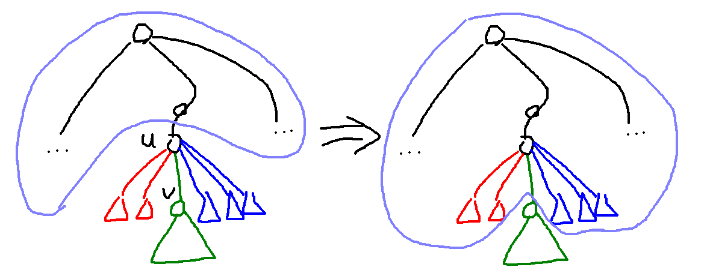

# rerooting / 全方位木 DP

因為最近打 ucup 遇到（有人抱怨他不會）所以想說就來簡單寫一篇小科普。

大方向來說，前提是根固定時，問題可以用簡單的樹 DP 解決，然後使用換根 DP 的技巧就可以快速計算出「對於所有 $i$，點 $i$ 當根時候的答案」。

## Description
> 例題： <https://atcoder.jp/contests/dp/tasks/dp_v>
> 給定一棵 $N$ 個點的樹。對於每個點 $i$，輸出有幾種把 $N$ 個頂點都塗成黑色或白色的方式，使得所有黑色頂點連通，且頂點 $i$ 是黑色的。
> $2 \leq N \leq 10^5$

## Solution

我們可以先考慮如果只要輸出 $i = 1$ 的答案該怎麼辦。
相信大家都會簡單的樹上連通塊的 DP：令 $dp_u$ 代表 $u$ 的子樹裡面有幾種塗色方式使得黑色是一個連通塊且這個子樹的根 $u$ 是黑色的。在一個合法的塗色方案當中，$u$ 已經固定是黑色，而 $u$ 的每個小孩 $v$ 都有兩種情形：黑色或白色，如果是黑色的話方案數是 $dp_v$，若是白色則 $v$ 這個子樹固定是全白的，方案數是 $1$。寫下來就是
$$
dp_u = \prod\limits _ {v \in child(u)} (1 + dp_v)
$$

接著，如果根從 $1$ 變成 $x$ 了之後，哪些點的 DP 值有變呢？從下面的圖我們可以發現，因為 DP 值是對整個子樹定義的，而圖中紅色和藍色的節點對應的子樹完全沒有變化，所以其實只有 $1$ 和 $x$ 這兩個點的 DP 值有可能會有變化！


當根從 $x$ 變成一個 $x$ 的鄰居 $y$ 的時候，只有 $x, y$ 兩個頂點的 DP 值會變化，具體來說會像是
$$
\begin{cases}
dp'_x = dp _ x \cdot \frac{1}{ 1 + dp_y } \\\\
dp'_y = dp _ y \cdot (1 + dp'_x)
\end{cases}
$$

因此，我們可以先 DFS 一遍，計算以 $1$ 為根時的整個 DP 陣列。
接著再跑一遍 DFS，每次遇到一個 $u$ 的小孩 $v$ 可以在 $O(1)$ 的時間（只修改 `dp[u]` 和 `dp[v]`）把 DP 陣列改成以 $v$ 為根，這樣我們就可以保證在遍歷到頂點 $u$ 的時候，整個 DP 陣列維護的是以 $u$ 為根對應的 DP 值。當然，要記得在離開 $v$ 之後撤銷這個改動，變回以 $u$ 為根的狀態。

在上面的論述中，我們假設了一個點拔掉一個小孩或是加上一個小孩之後 DP 值的變化可以快速算出來。在本題中，因為要模的數字 $M$ 不一定是一個質數（而且 $1 + dp_y$ 也可能是 $0$），所以我們不一定每次都可以除。一個常用的技巧是使用前綴和以及後綴和計算「去掉一個小孩之後的乘積」，這個技巧在取 max/min 類或是第 k 大之類的 DP 也可以用，基本上只要有結合律應該就可以想辦法組出來。以下是一個用這個想法完成的實做。

### AC code : 前綴後綴和

```cpp
#include <bits/stdc++.h>
using namespace std;

#define all(x) begin(x), end(x)
#ifdef CKISEKI
#include <experimental/iterator>
#define safe cerr<<__PRETTY_FUNCTION__<<" line "<<__LINE__<<" safe\n"
#define debug(a...) debug_(#a, a)
#define orange(a...) orange_(#a, a)
void debug_(auto s, auto ...a) {
  cerr << "\e[1;32m(" << s << ") = (";
  int f = 0;
  (..., (cerr << (f++ ? ", " : "") << a));
  cerr << ")\e[0m\n";
}
void orange_(auto s, auto L, auto R) {
  cerr << "\e[1;33m[ " << s << " ] = [ ";
  using namespace experimental;
  copy(L, R, make_ostream_joiner(cerr, ", "));
  cerr << " ]\e[0m\n";
}
#else
#define safe ((void)0)
#define debug(...) safe
#define orange(...) safe
#endif

signed main() {
  cin.tie(nullptr)->sync_with_stdio(false);
  int N, M;
  cin >> N >> M;
  vector<vector<int>> g(N);
  for (int i = 1; i < N; i++) {
    int u, v;
    cin >> u >> v;
    --u, --v;
    g[u].push_back(v);
    g[v].push_back(u);
  }

  auto mul = [&M](int64_t a, int64_t b) {
    return static_cast<int>(a * b % M);
  };

  vector<int> dp(N), ans(N), pre(N), suf(N);
  auto dfs = [&](auto &&self, int u, int pa) -> void {
    dp[u] = 1;
    for (int v : g[u]) {
      if (v == pa) continue;
      self(self, v, u);
      dp[u] = mul(dp[u], 1 + dp[v]);
    }
  };
  auto reroot = [&](auto &&self, int u, int pa) -> void {
    ans[u] = dp[u];
    // pre[v] 跟 suf[v] 代表從前面和從後面乘到 v 的積，
    // 乘積裡不包含 v 這一格，而且 **會包含 pa**
    {
      int prod = 1;
      for (int v : g[u]) {
        pre[v] = prod;
        prod = mul(prod, 1 + dp[v]);
      }
    }
    {
      int prod = 1;
      for (int v : g[u] | views::reverse) {
        suf[v] = prod;
        prod = mul(prod, 1 + dp[v]);
      }
    }

    for (int v : g[u]) {
      if (v == pa) continue;
      int orig_dpu = dp[u], orig_dpv = dp[v];
      dp[u] = mul(pre[v], suf[v]);
      dp[v] = mul(dp[v], 1 + dp[u]);
      self(self, v, u);
      dp[u] = orig_dpu;
      dp[v] = orig_dpv;
    }
  };
  dfs(dfs, 0, -1);
  reroot(reroot, 0, -1);
  for (int i = 0; i < N; i++)
    cout << ans[i] << '\n';
}
```

## 另一種想法：下行與上行

另一種比較 pure 的解決本題的想法是這樣的。
我們改令兩個 DP 陣列 $down_u, up_u$。

$down_u$ 定義為「以 $1$ 為根時，$u$ 對應的子樹的塗色方法數，限制 $u$ 要是黑色」
基本上，$down_u$ 的定義和遞迴式和前面的作法的第一輪 DFS 求 $dp_u$ 都差不多。

$up_u$ 的定義則變成是「以 $1$ 為根時，$u$ 對應的 **全方位子樹** 的塗色方法數，限制 $pa_u$ 要是黑色」。這裡，$pa_u$ 是以 $1$ 為根時的 parent。而 **全方位子樹** 的意思是把整棵樹去掉 $u$ 對應的子樹的部份，也就是說那些不是 $u$ 的子孫的點。
每當遇到一個 $u$ 的小孩 $v$，$up_v$ 可以從 $up_u$ 以及 $u$ 除了 $v$ 以外的小孩的 $down$ 值推出來，大概就像下面畫的這樣：


也就是說，我們可以遍歷兩次樹，第一次先從葉子開始從下往上計算 $down_u$，第二次則從樹根開始從上往下計算 $up_u$，得出所有 $up_u, down_u$ 之後我們可以把 $up_u, down_u$ 合在一起得出以 $u$ 為根時的答案，在本題的情況是 $(1 + up_u) \cdot down_u$。比較 tricky 的部份是我們要怎麼定樹根的 $up_u$：在本題中剛好定成 $0$ 可以讓樹根的小孩的 $up_u$ 都是對的，所以歸納地往下計算都是對的；在更一般的問題中，我們可能可以讓樹根的 $up_u$ 往下一層（本題對應到 $+1$）之後剛好變成 identity，或者乾脆不定義，直接對每個樹根的小孩都呼叫 `calc_up`。

### AC code
```cpp
#include <bits/stdc++.h>
using namespace std;

#define all(x) begin(x), end(x)
#ifdef CKISEKI
#include <experimental/iterator>
#define safe cerr<<__PRETTY_FUNCTION__<<" line "<<__LINE__<<" safe\n"
#define debug(a...) debug_(#a, a)
#define orange(a...) orange_(#a, a)
void debug_(auto s, auto ...a) {
  cerr << "\e[1;32m(" << s << ") = (";
  int f = 0;
  (..., (cerr << (f++ ? ", " : "") << a));
  cerr << ")\e[0m\n";
}
void orange_(auto s, auto L, auto R) {
  cerr << "\e[1;33m[ " << s << " ] = [ ";
  using namespace experimental;
  copy(L, R, make_ostream_joiner(cerr, ", "));
  cerr << " ]\e[0m\n";
}
#else
#define safe ((void)0)
#define debug(...) safe
#define orange(...) safe
#endif

signed main() {
  cin.tie(nullptr)->sync_with_stdio(false);
  int N, M;
  cin >> N >> M;
  vector<vector<int>> g(N);
  for (int i = 1; i < N; i++) {
    int u, v;
    cin >> u >> v;
    --u, --v;
    g[u].push_back(v);
    g[v].push_back(u);
  }

  auto mul = [&M](int64_t a, int64_t b) {
    return static_cast<int>(a * b % M);
  };

  vector<int> pa(N);
  vector<int> down(N);
  auto calc_down = [&](auto &&self, int u) -> void {
    down[u] = 1;
    for (int v : g[u]) {
      if (v == pa[u]) continue;
      pa[v] = u;
      self(self, v);
      down[u] = mul(down[u], 1 + down[v]);
    }
  };
  pa[0] = -1;
  calc_down(calc_down, 0);

  vector<int> pre(N), suf(N);
  for (int u = 0; u < N; u++)
    for (int prod = 1; int v : g[u]) {
      if (v == pa[u]) continue;
      pre[v] = prod;
      prod = mul(prod, 1 + down[v]);
    }
  for (int u = 0; u < N; u++)
    for (int prod = 1; int v : g[u] | views::reverse) {
      if (v == pa[u]) continue;
      suf[v] = prod;
      prod = mul(prod, 1 + down[v]);
    }

  vector<int> up(N);
  up[0] = 0;
  auto calc_up = [&](auto &&self, int u) -> void {
    for (int v : g[u]) {
      if (v == pa[u]) continue;
      up[v] = mul(1 + up[u], mul(pre[v], suf[v]));
      self(self, v);
    }
  };
  calc_up(calc_up, 0);

  for (int i = 0; i < N; i++) {
    int ans = mul(1 + up[i], down[i]);
    cout << ans << '\n';
  }
}
```

**全方位子樹** 這個名字我也不知道哪裡來的，只是感覺這樣叫很順。

## 參考資料與延伸閱讀

- https://drken1215.hatenablog.com/entry/2024/04/15/135700
- https://atcoder-tags.herokuapp.com/tags/Dynamic-Programming/Every-Direction-DP
    - https://atcoder.jp/contests/abc220/tasks/abc220_f
    - https://atcoder.jp/contests/dp/tasks/dp_v
    - https://atcoder.jp/contests/abc223/tasks/abc223_g
    - https://atcoder.jp/contests/arc097/tasks/arc097_d
- https://oi-wiki.org/dp/tree/#%E6%8D%A2%E6%A0%B9-dp
- https://slides.com/ck1110530/trees#/3
- https://codeforces.com/blog/entry/124286
